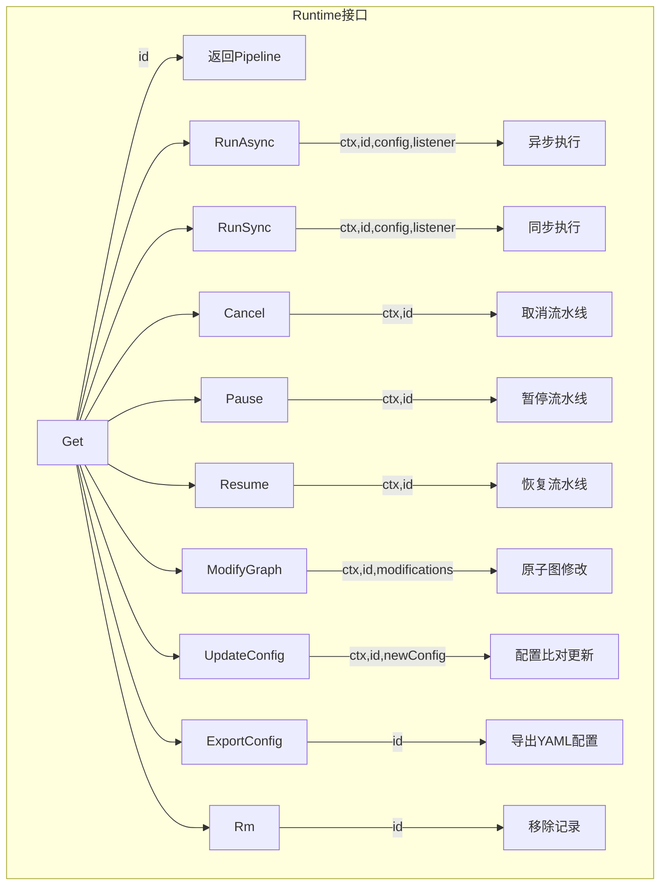
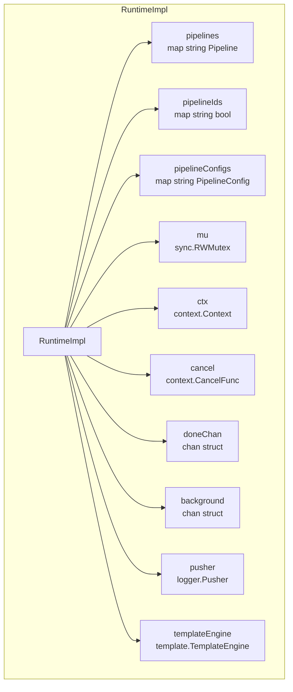
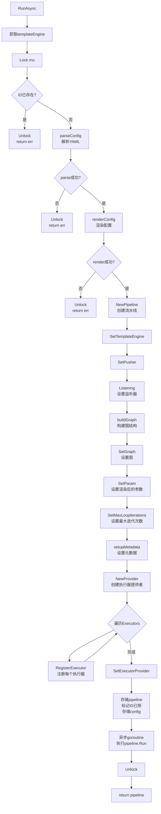
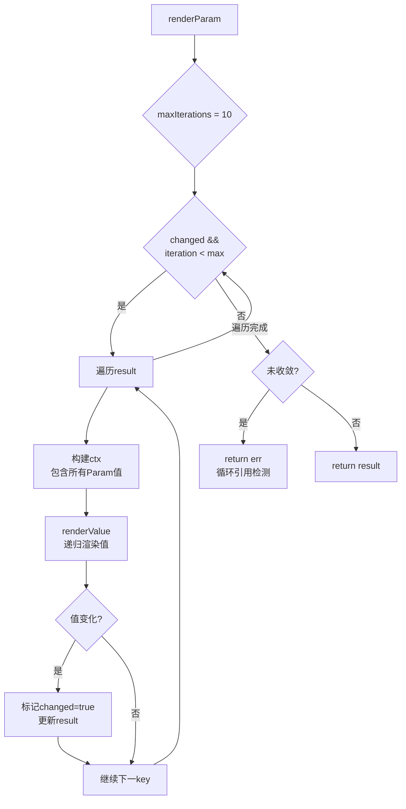
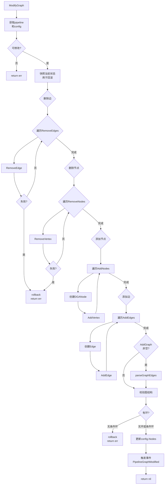
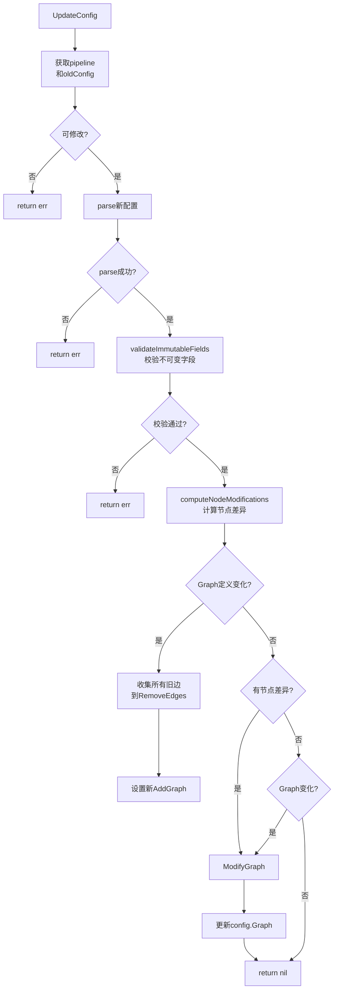
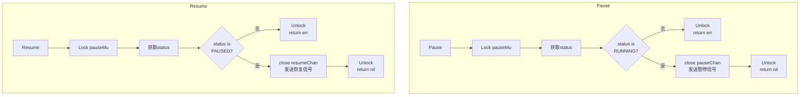
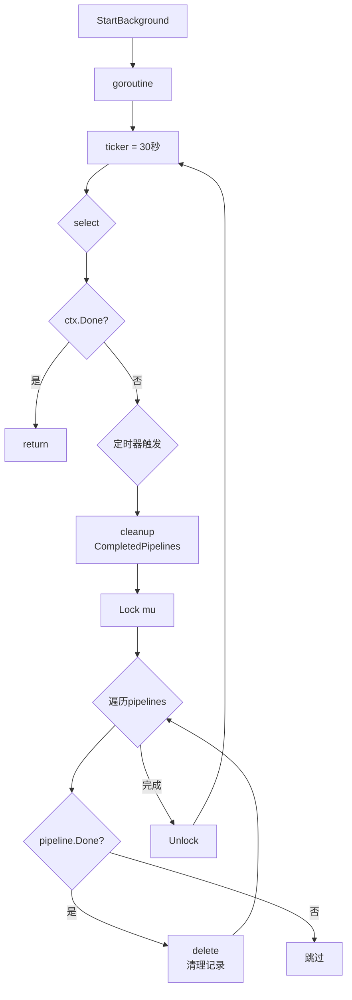
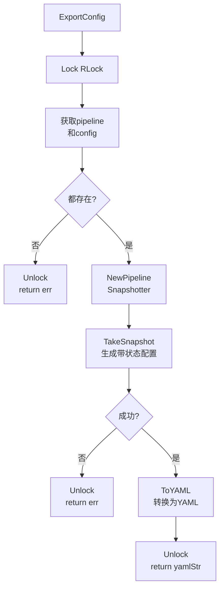

# Runtime 模块流程图

## Runtime 接口



## RuntimeImpl 结构



## RunAsync 执行流程



## renderConfig 配置渲染

```mermaid
flowchart TD
    A[renderConfig] --> B[转换Param<br/>map string interface<br/>to map string FieldItem]
    B --> C[构建ctx<br/>包含Param值]
    C --> D[ctx["Param"] = ctx<br/>自引用]

    D --> E{param非空?}
    E -->|是| F[renderParam<br/>迭代渲染]
    E -->|否| G[跳过Param渲染]

    F --> H{达到最大迭代<br/>或收敛?}
    H -->|是| I[继续]
    H -->|否| F
    G --> J[更新config.Param<br/>值]

    J --> K{metadata非空?}
    K -->|是| L[转换Metadata.Data<br/>为FieldItem]
    K -->|否| Z[return]
    L --> M[构建ctx<br/>包含Param]
    M --> N[renderMetadata<br/>渲染metadata]
    N --> O[更新config<br/>MetadateData]
    O --> Z
```

## renderParam 迭代渲染



## buildGraph 图构建

```mermaid
flowchart TD
    A[buildGraph] --> B[NewDGAGraph]
    B --> C{遍历config.Nodes}
    C --> D[创建DGANode]
    D --> E[EnsureIds<br/>确保步骤有ID]
    E --> F[AddVertex<br/>添加节点到图]
    F --> C

    C -->|完成| G{config.Graph<br/>非空?}
    G -->|否| Z[return graph]
    G -->|是| H[parseGraphEdges]

    H --> I[NewStateParser]
    I --> J[Parse图字符串]
    J --> K{解析成功?}
    K -->|否| Z
    K -->|是| L[遍历Statements]

    L --> M{是Transition?}
    M -->|是| N{from is "[*]"?}
    N -->|是| O[AddEntryNode]
    N -->|否| P{to is "[*]"?}
    P -->|是| Q[AddExitNode]
    P -->|否| R[提取条件表达式]

    R --> S{有条件?}
    S -->|是| T[NewConditionalEdge]
    S -->|否| U[NewDGAEdge]
    T --> V[AddEdge]
    U --> V
    V --> L
    M -->|否| L
```

## parseGraphEdges 边解析

```mermaid
flowchart TD
    A[parseGraphEdges] --> B[遍历Transition]
    B --> C{from is "[*]"?}
    C -->|是| D[AddEntryNode]
    D --> E[continue]
    C -->|否| F{to is "[*]"?}
    F -->|是| G[AddExitNode]
    G --> E
    F -->|否| H[查找源和目标节点]
    H --> I{节点都存在?}
    I -->|否| B
    I -->|是| J[extractExpression<br/>提取条件]

    J --> K{有条件表达式?}
    K -->|是| L[NewConditionalEdge]
    K -->|否| M[NewDGAEdge]
    L --> N[AddEdge]
    M --> N
    N --> B
```

## ModifyGraph 图修改



## UpdateConfig 配置更新



## Pause/Resume 暂停恢复



## 后台清理机制



## 配置导出

