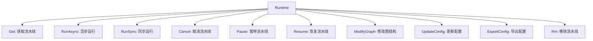
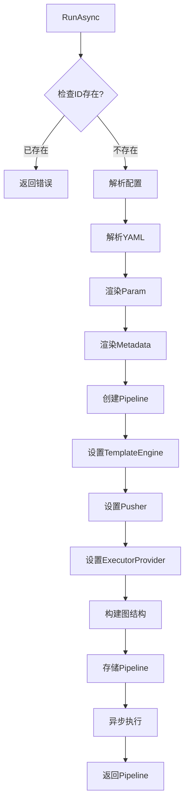
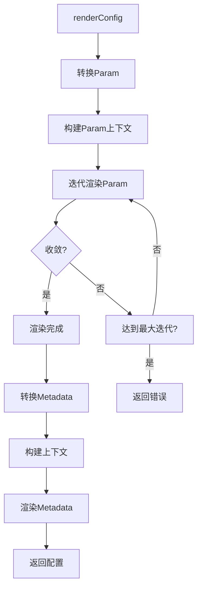
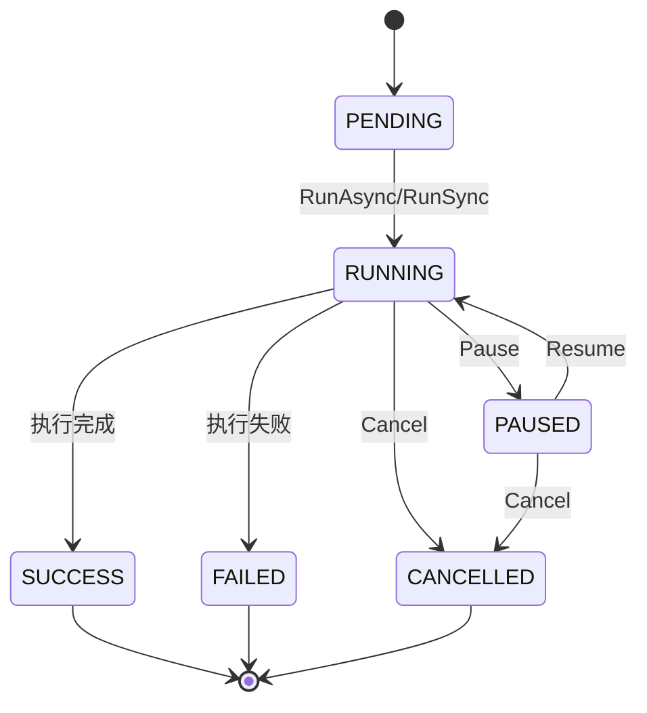
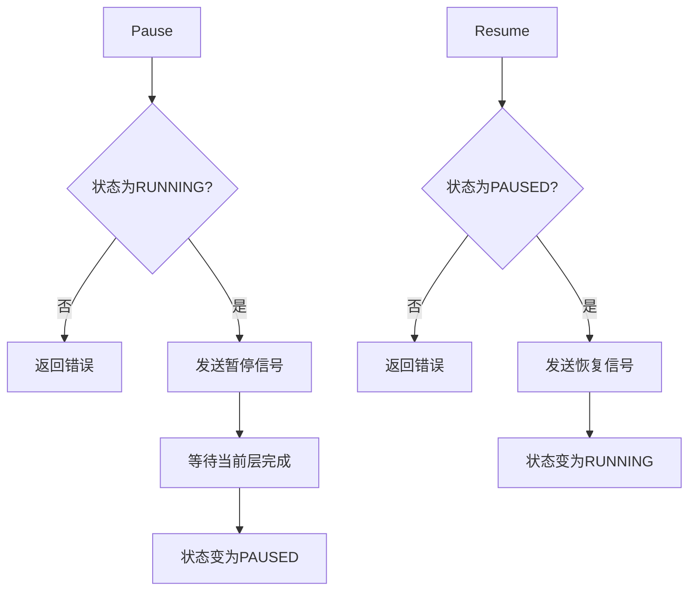
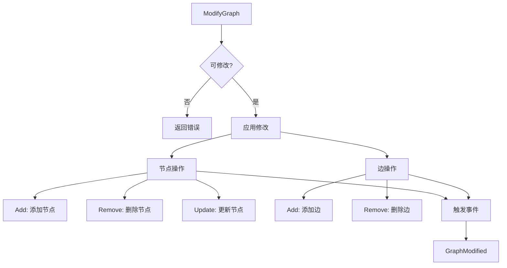
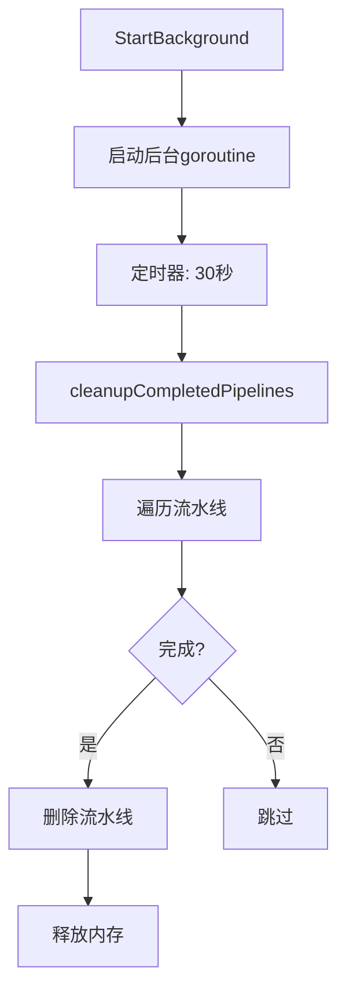

# Runtime 模块流程图
## [注: 此文件已移动至 runtime_graph.go]

## Runtime 运行流程

```mermaid
flowchart TD
    A[Runtime] --> B[Get: 获取流水线]
    A --> C[RunAsync: 异步运行]
    A --> D[RunSync: 同步运行]
    A --> E[Cancel: 取消流水线]
    A --> F[Pause: 暂停流水线]
    A --> G[Resume: 恢复流水线]
    A --> H[ModifyGraph: 修改图结构]
    A --> I[UpdateConfig: 更新配置]
    A --> J[ExportConfig: 导出配置]
    A --> K[Rm: 移除流水线]
```

## 异步运行流程

```mermaid
flowchart TD
    A[RunAsync] --> B{检查ID存在?}
    B -->|已存在| C[返回错误]
    B -->|不存在| D[解析配置]

    D --> E[解析YAML]
    E --> F[渲染Param]
    F --> G[渲染Metadata]
    G --> H[创建Pipeline]

    H --> I[设置TemplateEngine]
    I --> J[设置Pusher]
    J --> K[设置ExecutorProvider]
    K --> L[构建图结构]

    L --> M[存储Pipeline]
    M --> N[异步执行]
    N --> O[返回Pipeline]
```

## 配置渲染流程

```mermaid
flowchart TD
    A[renderConfig] --> B[转换Param]
    B --> C[构建Param上下文]

    C --> D[迭代渲染Param]
    D --> E{收敛?}
    E -->|是| F[渲染完成]
    E -->|否| G[达到最大迭代?]
    G -->|否| D
    G -->|是| H[返回错误]

    F --> I[转换Metadata]
    I --> J[构建上下文]
    J --> K[渲染Metadata]
    K --> L[返回配置]
```

## 流水线生命周期

```mermaid
stateDiagram-v2
    [*] --> PENDING
    PENDING --> RUNNING: RunAsync/RunSync
    RUNNING --> PAUSED: Pause
    PAUSED --> RUNNING: Resume
    RUNNING --> SUCCESS: 执行完成
    RUNNING --> FAILED: 执行失败
    RUNNING --> CANCELLED: Cancel
    PAUSED --> CANCELLED: Cancel
    SUCCESS --> [*]
    FAILED --> [*]
    CANCELLED --> [*]
```

## 暂停恢复流程

```mermaid
flowchart TD
    A[Pause] --> B{状态为RUNNING?}
    B -->|否| C[返回错误]
    B -->|是| D[发送暂停信号]
    D --> E[等待当前层完成]
    E --> F[状态变为PAUSED]

    A2[Resume] --> G{状态为PAUSED?}
    G -->|否| H[返回错误]
    G -->|是| I[发送恢复信号]
    I --> J[状态变为RUNNING]
```

## 图修改流程

```mermaid
flowchart TD
    A[ModifyGraph] --> B{可修改?}
    B -->|否| C[返回错误]
    B -->|是| D[应用修改]

    D --> E[节点操作]
    E --> F[Add: 添加节点]
    E --> G[Remove: 删除节点]
    E --> H[Update: 更新节点]

    D --> I[边操作]
    I --> J[Add: 添加边]
    I --> K[Remove: 删除边]

    E --> L[触发事件]
    I --> L
    L --> M[GraphModified]
```

## 后台清理流程

```mermaid
flowchart TD
    A[StartBackground] --> B[启动后台goroutine]
    B --> C[定时器: 30秒]
    C --> D[cleanupCompletedPipelines]

    D --> E[遍历流水线]
    E --> F{完成?}
    F -->|是| G[删除流水线]
    F -->|否| H[跳过]

    G --> I[释放内存]
```