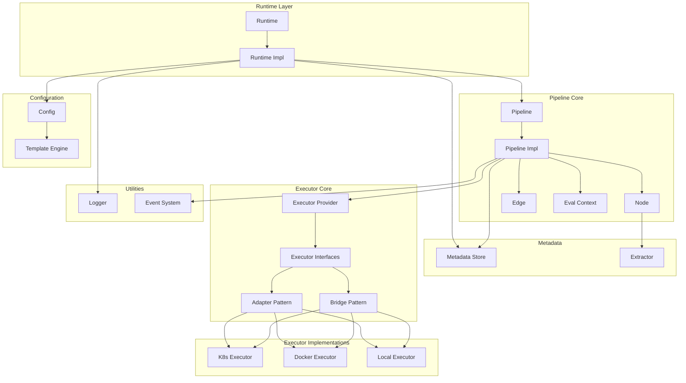

[中文文档](./README_ZH.md)

# FlowX

<p align="center">
  
</p>

A flexible and extensible pipeline execution library for Go, supporting multiple execution backends and DAG-based workflow orchestration.

[](https://golang.org)
[](LICENSE)

## Features

- **DAG-Based Workflow**: Define complex pipelines using Directed Acyclic Graph (DAG) structure with Mermaid syntax
- **Cyclic Graph Support**: Conditional back-edges for controlled loops with `iteration` counter
- **Multi-Backend Execution**: Support for Local, Docker, and Kubernetes executors
- **Concurrent Execution**: Independent tasks run in parallel for optimal performance
- **Conditional Edges**: Dynamic execution paths with template-based condition expressions
- **Event-Driven Architecture**: Monitor pipeline lifecycle through event listeners
- **Template Engine**: Dynamic configuration rendering with Pongo2 templates
- **Metadata Management**: Process-safe metadata storage and retrieval
- **Log Streaming**: Real-time log output with customizable log pushing
- **Output Extraction**: Extract structured data from command output using codec-block or regex patterns
- **Runtime Recovery**: Resume pipeline execution from saved state
- **Pause & Resume**: Pause running pipelines and modify graph structure during pause
- **Dynamic Graph Modification**: Add/remove nodes and edges at runtime
- **Data Passing**: Share data between nodes using metadata

## Installation

```bash
go get github.com/LerkoX/flowx
```

## Quick Start

```go
package main

import (
    "context"
    "fmt"

    "github.com/LerkoX/flowx"
)

func main() {
    ctx := context.Background()

    // Create runtime
    runtime := flowx.NewRuntime(ctx)

    // Pipeline configuration
    config := `
Version: "1.0"
Name: example-pipeline

Executors:
  local:
    type: local
    config:
      shell: bash

Graph: |
  stateDiagram-v2
    [*] --> Build
    Build --> Test
    Test --> [*]

Nodes:
  Build:
    executor: local
    steps:
      - name: build
        run: echo "Building..."
  Test:
    executor: local
    steps:
      - name: test
        run: echo "Testing..."
`

    // Execute pipeline synchronously
    pipeline, err := runtime.RunSync(ctx, "pipeline-1", config, nil)
    if err != nil {
        fmt.Printf("Pipeline failed: %v\n", err)
        return
    }

    fmt.Println("Pipeline completed successfully!")
}
```

## Output Extraction

FlowX supports extracting structured data from command output and saving it to pipeline metadata for use in subsequent nodes. Extracted data includes field descriptions (from comments) and source node tracking.

### Codec-Block Extraction

Automatically recognizes and parses `flowx-yaml` code blocks:

```yaml
Nodes:
  Build:
    executor: local
    extract:
      type: codec-block
      maxOutputSize: 1048576  # Optional, default 1MB
    steps:
      - name: build
        run: |
          echo "Building..."
          echo '```flowx-yaml'
          echo 'buildId: "12345"  # 构建ID'
          echo 'version: "1.0.0"  # 版本号'
          echo '```'
```

This extracts `buildId` and `version` from output with descriptions, and makes them available as `{{ .Metadata.Build.buildId }}` and `{{ .Metadata.Build.version }}`.

### Regex Extraction

Extract data using regular expressions:

```yaml
Nodes:
  Test:
    executor: local
    extract:
      type: regex
      patterns:
        coverage: "coverage: (\\d+\\.\\d+)%"
        tests: "(\\d+) tests? passed"
      maxOutputSize: 524288
    steps:
      - name: test
        run: go test -cover
```

This extracts test coverage and count from command output.

## Configuration

FlowX uses YAML configuration with the following structure:

```yaml
Version: "1.0"              # Configuration version
Name: my-pipeline           # Pipeline name

Metadate:                   # Metadata configuration
  type: in-config           # Store type: in-config, redis, http
  data:
    key: value

Param:                      # Pipeline parameters
  buildId: "123"
  branch: "main"

Executors:                  # Global executor definitions
  local:
    type: local
    config:
      shell: bash
      workdir: /tmp

  docker:
    type: docker
    config:
      registry: docker.io
      network: host
      volumes:
        - /var/run/docker.sock:/var/run/docker.sock

Graph: |                    # DAG definition (Mermaid stateDiagram-v2)
  stateDiagram-v2
    [*] --> Build
    Build --> Test
    Test --> Deploy
    Deploy --> [*]

Nodes:                      # Node definitions
  Build:
    executor: local
    steps:
      - name: build
        run: go build .

  Test:
    executor: docker
    image: golang:1.21
    steps:
      - name: test
        run: go test ./...
```

## Executors

### Local Executor
Executes commands on the local machine.

```yaml
Executors:
  local:
    type: local
    config:
      shell: bash          # Shell to use (bash, sh, zsh)
      workdir: /tmp        # Working directory
      env:                 # Environment variables
        KEY: value
      timeout: "30s"       # Command timeout
      pty: true            # Enable PTY for interactive programs
```

### Docker Executor
Executes commands inside Docker containers.

```yaml
Executors:
  docker:
    type: docker
    config:
      registry: docker.io   # Image registry
      network: host         # Network mode
      workdir: /app         # Container working directory
      tty: true             # Enable TTY
      ttyWidth: 120         # TTY width
      ttyHeight: 40         # TTY height
      volumes:              # Volume mounts
        - /host/path:/container/path
      env:                  # Environment variables
        GO_VERSION: "1.21"
```

### Kubernetes Executor
Executes commands inside Kubernetes pods.

```yaml
Executors:
  k8s:
    type: k8s
    config:
      namespace: default
      serviceAccount: pipeline-sa
      podReadyTimeout: "60s"  # Pod ready timeout
```

> **Note:** The `ssh` executor type is reserved but not yet implemented. Only `local`, `docker`, and `k8s`/`kubernetes` are currently supported.

## Conditional Edges

Define conditional execution paths using template expressions:

```yaml
Graph: |
  stateDiagram-v2
    [*] --> Build
    Build --> Deploy: {{ Param.branch == "main" }}
    Build --> Test: {{ Param.branch != "main" }}
    Test --> [*]
    Deploy --> [*]
```

Complex conditions are supported:

```yaml
# Multiple conditions
QualityCheck --> DeployStaging: {{ QualityCheck.allTestsPassed == true and QualityCheck.codeCoverage >= 80 }}

# Nested conditions
Deploy --> Production: {{ Param.environment == "production" and ManualApproval.approved == true }}
```

## Cyclic Graph (Loop Execution)

FlowX supports controlled loops through conditional back-edges. A conditional edge that creates a cycle is accepted as a back-edge, enabling iterative execution.

```yaml
MaxLoopIterations: 5          # Safety limit (default: 100)

Graph: |
  stateDiagram-v2
    [*] --> A
    A --> B
    B --> C
    C --> A: {{ iteration < 3 }}    # Back-edge: loop 3 times
    C --> D
    D --> [*]
```

The `iteration` variable starts at 0 and increments each loop. In this example, nodes A→B→C→D execute 3 times, then the loop exits.

> See [Conditional Edges](doc/edge.md) for details on back-edges and `iteration`.

## Dynamic Graph Modification

FlowX supports modifying the pipeline graph at runtime. You can add/remove nodes and edges while the pipeline is paused.

### Using ModifyGraph (Fine-grained Control)

```go
import (
    "github.com/LerkoX/flowx/core"
    "github.com/LerkoX/flowx/dag"
)

err := runtime.ModifyGraph(ctx, "pipeline-id", dag.GraphModifications{
    AddNodes: []core.NodeConfig{
        {
            Name: "NewNode",
            Executor: "local",
            Steps: []core.Step{
                {Name: "step1", Run: "echo 'New step'"},
            },
        },
    },
    AddEdges: []dag.EdgeModification{
        {Source: "ExistingNode", Target: "NewNode", Expression: ""},
    },
    RemoveNodes: []string{"UnusedNode"},
    RemoveEdges: []dag.EdgeRemoval{{Source: "A", Target: "B"}},
})
```

### Using UpdateConfig (Config-based Diff)

Update the pipeline by providing a new YAML configuration. FlowX automatically computes the difference and applies the changes:

```go
newConfig := `
Version: "1.0"
Name: my-pipeline

Graph: |
  stateDiagram-v2
    [*] --> Build
    Build --> Deploy
    Deploy --> [*]

Nodes:
  Build:
    executor: local
    steps:
      - name: build
        run: echo "Building..."
  Deploy:
    executor: local
    steps:
      - name: deploy
        run: echo "Deploying..."
`

err := runtime.UpdateConfig(ctx, "pipeline-id", newConfig)
```

Rules:
- Nodes that have already executed cannot be removed or modified
- New nodes will execute on resume
- Edges can only be removed if neither endpoint has executed

> See [doc/runtime.md](doc/runtime.md) for detailed API documentation.

## Data Passing

Share data between nodes using metadata:

```yaml
Nodes:
  Generate:
    executor: local
    steps:
      - name: generate
        run: |
          echo '```flowx-yaml'
          echo 'value: 42  # 计算结果'
          echo 'message: "hello world"  # 消息内容'
          echo '```'
    extract:
      type: codec-block

  Process:
    executor: local
    steps:
      - name: process
        run: |
          echo "Processing value: {{ .Metadata.Generate.value }}"
          echo "Message: {{ .Metadata.Generate.message }}"
```

## Runtime Recovery

Resume pipeline execution from saved state:

```yaml
Nodes:
  Build:
    executor: local
    runtime:                    # Node runtime status for recovery
      status: "SUCCESS"         # Already completed, will be skipped
      startTime: "2026-03-30T10:00:00Z"
      endTime: "2026-03-30T10:01:00Z"
      steps:
        - name: build
          status: "SUCCESS"
          output: "Build completed"
    steps:
      - name: build
        run: echo "Building..."

  Test:
    executor: local
    runtime:                    # Node runtime status for recovery
      status: "PENDING"         # Will execute
    steps:
      - name: test
        run: echo "Testing..."
```

## Event Monitoring

Monitor pipeline execution through event listeners. Implement the `dag.Listener` interface and use event constants from the `core` package:

```go
import (
    "github.com/LerkoX/flowx/core"
    "github.com/LerkoX/flowx/dag"
)

type MyListener struct{}

func (l *MyListener) Events() []dag.Event {
    return []dag.Event{
        core.EventPipelineInit,
        core.EventPipelineStart,
        core.EventPipelineFinish,
        core.EventPipelineExecutorPrepare,
        core.EventPipelineExecutorPrepareDone,
        core.EventPipelineNodeStart,
        core.EventPipelineNodeFinish,
        core.EventPipelineNodeFailed,
        core.EventPipelineCancelled,
        core.EventPipelineStatusUpdate,
        core.EventPipelinePaused,
        core.EventPipelineResumed,
        core.EventPipelineGraphModified,
    }
}

func (l *MyListener) Handle(p dag.Pipeline, event dag.Event) {
    switch event {
    case core.EventPipelineInit:
        fmt.Println("Pipeline initialized")
    case core.EventPipelineStart:
        fmt.Println("Pipeline started")
    case core.EventPipelineFinish:
        fmt.Println("Pipeline finished")
    case core.EventPipelineExecutorPrepare:
        fmt.Println("Executor preparing")
    case core.EventPipelineExecutorPrepareDone:
        fmt.Println("Executor prepared")
    case core.EventPipelineNodeStart:
        fmt.Println("Node started")
    case core.EventPipelineNodeFinish:
        fmt.Println("Node completed")
    case core.EventPipelineNodeFailed:
        fmt.Println("Node failed")
    case core.EventPipelineCancelled:
        fmt.Println("Pipeline cancelled")
    case core.EventPipelineStatusUpdate:
        fmt.Println("Pipeline status updated")
    case core.EventPipelinePaused:
        fmt.Println("Pipeline paused")
    case core.EventPipelineResumed:
        fmt.Println("Pipeline resumed")
    case core.EventPipelineGraphModified:
        fmt.Println("Pipeline graph modified")
    }
}

pipeline, err := runtime.RunSync(ctx, "id", config, &MyListener{})
```

**Available Events:**

| Event | Description |
|-------|-------------|
| `PipelineInit` | Pipeline initialized |
| `PipelineStart` | Pipeline started |
| `PipelineFinish` | Pipeline finished (success or failure) |
| `PipelineExecutorPrepare` | Node executor is being prepared |
| `PipelineExecutorPrepareDone` | Node executor preparation completed |
| `PipelineNodeStart` | Node execution started |
| `PipelineNodeFinish` | Node execution finished |
| `PipelineNodeFailed` | Node execution failed |
| `PipelineCancelled` | Pipeline cancelled |
| `PipelineStatusUpdate` | Pipeline status changed |
| `PipelinePaused` | Pipeline paused |
| `PipelineResumed` | Pipeline resumed |
| `PipelineGraphModified` | Pipeline graph was modified |

## Architecture



## Examples

See [examples/workflows/README.md](./examples/workflows/README.md) for detailed workflow examples:

- **File Processing**: Automated log archiving and cleanup
- **Data ETL**: Parallel data collection and transformation
- **CI/CD Deployment**: Complete deployment pipeline with quality gates
- **Weather Notification**: Weather API integration with messaging

## API Reference

Types `Pipeline`, `Listener`, `Event`, `GraphModifications`, `EdgeModification`, and `EdgeRemoval` are defined in the `dag` package (`github.com/LerkoX/flowx/dag`). `NodeConfig` and `Step` are defined in the `core` package (`github.com/LerkoX/flowx/core`). Event constants (e.g., `core.EventPipelineStart`) are also in the `core` package.

### Runtime

```go
type Runtime interface {
    Get(id string) (dag.Pipeline, error)                          // Get pipeline by ID
    Cancel(ctx context.Context, id string) error                  // Cancel running pipeline
    RunAsync(ctx context.Context, id string, config string, listener dag.Listener) (dag.Pipeline, error)  // Async execution
    RunSync(ctx context.Context, id string, config string, listener dag.Listener) (dag.Pipeline, error)   // Sync execution
    Rm(id string)                                                 // Remove pipeline record
    Done() chan struct{}                                          // Runtime completion signal
    Notify(data interface{}) error                                // Notify runtime
    Ctx() context.Context                                         // Get runtime context
    StopBackground()                                              // Stop background processing
    StartBackground()                                             // Start background processing
    SetPusher(pusher logger.Pusher)                               // Set log pusher
    SetTemplateEngine(engine template.TemplateEngine)             // Set template engine
    GetTemplateEngine() template.TemplateEngine                   // Get template engine
    ExportConfig(id string) (string, error)                       // Export pipeline config
    Pause(ctx context.Context, id string) error                   // Pause running pipeline
    Resume(ctx context.Context, id string) error                  // Resume paused/stopped pipeline
    ModifyGraph(ctx context.Context, id string, modifications dag.GraphModifications) error // Modify graph atomically
    UpdateConfig(ctx context.Context, id string, newConfigYAML string) error // Update pipeline via YAML diff
    ListPipelines() []string                                      // List active pipeline IDs
}
```

### Pipeline

```go
type Pipeline interface {
    Id() string                                               // Get pipeline ID
    GetGraph() dag.Graph                                      // Get DAG graph
    SetGraph(graph dag.Graph)                                 // Set DAG graph
    Status() string                                           // Get pipeline status
    SetMetadata(store metadata.MetadataStore)                 // Set metadata store
    Metadata() dag.Metadata                                   // Get pipeline metadata
    Listening(listener dag.Listener)                          // Set event listener
    Done() <-chan struct{}                                    // Pipeline completion signal
    Run(ctx context.Context) error                            // Run pipeline
    Notify()                                                  // Step notifies pipeline
    Cancel()                                                  // Cancel pipeline
    SetExecutorProvider(provider dag.ExecutorProvider)        // Set executor provider
    SetTemplateEngine(engine template.TemplateEngine)          // Set template engine
    GetTemplateEngine() template.TemplateEngine               // Get template engine
    SetPusher(pusher logger.Pusher)                           // Set log pusher
    Pause() error                                             // Pause pipeline (waits for current level)
    Resume(ctx context.Context) error                         // Resume paused pipeline
    IsModifiable() bool                                       // Check if graph can be modified
    CurrentNode() dag.Node                                    // Return currently executing node (if any)
}
```

## Testing

```bash
go test ./...
```

## Contributing

Contributions are welcome! Please feel free to submit a Pull Request.

## License

MIT License - see [LICENSE](LICENSE) for details.
