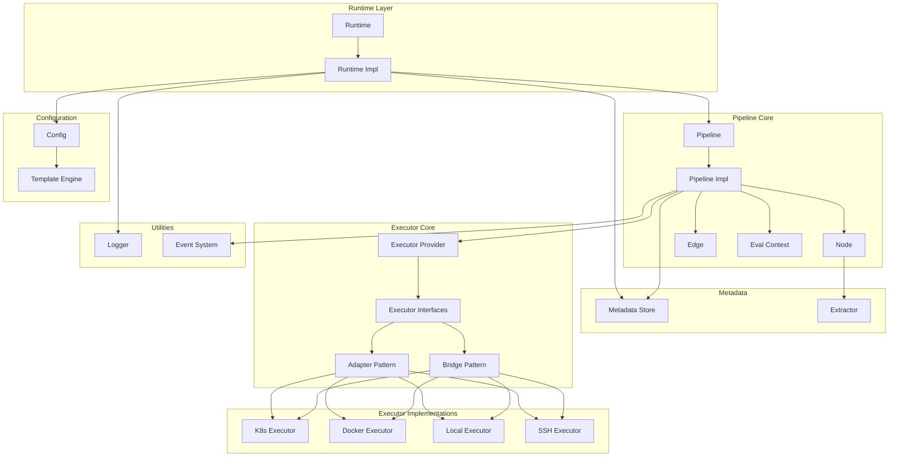

[English Documentation](./README.md)

# FlowX

<p align="center">
  
</p>

一个灵活且可扩展的 Go 语言流水线执行库，支持多种执行后端和基于 DAG 的工作流编排。

[](https://golang.org)
[](LICENSE)

## 特性

- **DAG 工作流**：使用 Mermaid 语法定义复杂的流水线有向无环图结构
- **循环图支持**：条件回边实现可控循环，通过 `iteration` 变量控制迭代次数
- **多后端执行**：支持本地、Docker 和 Kubernetes 执行器
- **并发执行**：独立任务并行运行以获得最佳性能
- **条件边**：使用模板表达式实现动态执行路径
- **事件驱动架构**：通过事件监听器监控流水线生命周期
- **模板引擎**：使用 Pongo2 模板进行动态配置渲染
- **元数据管理**：进程安全的元数据存储和检索
- **日志流式传输**：实时日志输出，支持自定义日志推送
- **输出提取**：支持通过代码块或正则表达式从命令输出提取结构化数据
- **运行时恢复**：支持从保存状态恢复流水线执行
- **暂停恢复**：流水线可暂停/恢复，暂停期间支持修改图结构
- **动态图修改**：运行时安全添加/删除节点和边
- **数据传递**：节点间通过元数据共享数据

## 安装

```bash
go get github.com/LerkoX/flowx
```

## 快速开始

```go
package main

import (
    "context"
    "fmt"
    "github.com/LerkoX/flowx"
)

func main() {
    ctx := context.Background()

    // 创建运行时
    runtime := flowx.NewRuntime(ctx)

    // 流水线配置
    config := `
Version: "1.0"
Name: example-pipeline

Executors:
  local
    type: local
    config:
      shell: bash

Graph: |
  stateDiagram-v2
    [*] --> Build
    Build --> Test
    Test --> [*]

Nodes:
  Build:
    executor: local
    steps:
      - name: build
        run: echo "Building..."
  Test:
    executor: local
    steps:
      - name: test
        run: echo "Testing..."
`

    // 同步执行流水线
    pipeline, err := runtime.RunSync(ctx, "pipeline-1", config, nil)
    if err != nil {
        fmt.Printf("流水线执行失败: %v\n", err)
        return
    }

    fmt.Println("流水线执行成功!")
}
```

## 输出提取

FlowX 支持从命令输出提取结构化数据并保存到流水线元数据，供后续节点使用。

### Codec-Block 提取

自动识别并解析 `flowx-json` 和 `flowx-yaml` 代码块：

```yaml
Nodes:
  Build:
    executor: local
    extract:
      type: codec-block
      maxOutputSize: 1048576  # 可选，默认 1MB
    steps:
      - name: build
        run: |
          echo "Building..."
          echo '```flowx-json'
          echo '{"buildId": "12345", "version": "1.0.0"}'
          echo '```'
```

这将从输出中提取 `buildId` 和 `version`，使其可作为 `{{ .Metadata.Build.buildId }}` 和 `{{ .Metadata.Build.version }}` 使用。

### 正则表达式提取

使用正则表达式提取数据：

```yaml
Nodes:
  Test:
    executor: local
    extract:
      type: regex
      patterns:
        coverage: "coverage: (\\d+\\.\\d+)%"
        tests: "(\\d+) tests? passed"
      maxOutputSize: 524288
    steps:
      - name: test
        run: go test -cover
```

这将从命令输出中提取测试覆盖率和测试数量。

## 配置说明

FlowX 使用 YAML 配置，结构如下：

```yaml
Version: "1.0"              # 配置版本
Name: my-pipeline           # 流水线名称

Metadate:                   # 元数据配置
  type: in-config           # 存储类型：in-config, redis, http
  data:
    key: value

Param:                      # 流水线参数
  buildId: "123"
  branch: "main"

Executors:                  # 全局执行器定义
  local:
    type: local
    config:
      shell: bash
      workdir: /tmp

  docker:
    type: docker
    config:
      registry: docker.io
      network: host
      volumes:
        - /var/run/docker.sock:/var/run/docker.sock

Graph: |                    # DAG DAG 定义（Mermaid stateDiagram-v2 语法）
  stateDiagram-v2
    [*] --> Build
    Build --> Test
    Test --> Deploy
    Deploy --> [*]

Nodes:                      # 节点定义
  Build:
    executor: local
    steps:
      - name: build
        run: go build .

  Test:
    executor: docker
    image: golang:1.21
    steps:
      - name: test
        run: go test ./...
```

## 执行器

### 本地执行器
在本地机器上执行命令。

```yaml
Executors:
  local:
    type: local
    config:
      shell: bash          # 使用的 Shell（bash, sh, zsh）
      workdir: /tmp        # 工作目录
      env:                 # 环境变量
        KEY: value
      timeout: "30s"       # 命令超时时间
      pty: true            # 启用 PTY 支持交互式程序
```

### Docker 执行器
在 Docker 容器内执行命令。

```yaml
Executors:
  docker:
    type: docker
    config:
      registry: docker.io   # 镜像仓库
      network: host         # 网络模式
      work: /app          # 容器内工作目录
      tty: true             # 启用 TTY
      ttyWidth: 120         # TTY 宽度
      ttyHeight: 40         # TTY 高度
      volumes:              # 卷挂载
        - /host/path:/container/path
      env:                  # 环境变量
        GO_VERSION: "1.21"
```

### Kubernetes 执行器
在 Kubernetes Pod 内执行命令。

```yaml
Executors:
  k8s:
    type: k8s
    config:
      namespace: default
      serviceAccount: pipeline-sa
      podReadyTimeout: "60s"  # Pod 就绪等待超时
```

## 条件边

使用模板表达式定义条件执行路径：

```yaml
Graph: |
  stateDiagram-v2
    [*] --> Build
    Build --> Deploy: {{ Param.branch == "main" }}
    Build --> Test: {{ Param.branch != "main" }}
    Test --> [*]
    Deploy --> [*]
```

支持复杂条件：

```yaml
# 多条件
QualityCheck --> DeployStaging: {{ QualityCheck.allTestsPassed == true and QualityCheck.codeCoverage >= 80 }}

# 嵌套条件
Deploy --> Production: {{ Param.environment == "production" and ManualApproval.approved == true }}
```

## 循环图（Loop Execution）

FlowX 通过条件回边支持可控循环。当条件边形成环路时，引擎将其标记为回边，实现迭代执行。

```yaml
MaxLoopIterations: 5          # 安全限制（默认 100）

Graph: |
  stateDiagram-v2
    [*] --> A
    A --> B
    B --> C
    C --> A: {{ iteration < 3 }}    # 回边：循环 3 次
    C --> D
    D --> [*]
```

`iteration` 变量从 0 开始，每次循环 +1。上例中 A→B→C→D 执行 3 轮后循环结束。

> 详见 [条件边](doc/edge.md) 中回边和 `iteration` 说明。

## 数据传递

通过元数据在节点间共享数据：

```yaml
Nodes:
  Generate:
    executor: local
    steps:
      - name: generate
        run: |
          echo '```flowx-json'
          echo '{"value": 42, "message": "hello world"}'
          echo '```'
    extract:
      type: codec-block

  Process:
    executor: local
    steps:
      - name: process
        run: |
          echo "Processing value: {{ .Metadata.Generate.value }}"
          echo "Message: {{ .Metadata.Generate.message }}"
```

## 运行时恢复

如果流水线执行失败，可以记录节点状态以便下次恢复：

```yaml
Nodes:
  Build:
    executor: local
    runtime:                    # 节点运行时状态用于恢复
      status: "SUCCESS"         # 已完成，会被跳过
      startTime: "2026-03-30T10:00:00Z"
      endTime: "2026-03-30T10:01:00Z"
      steps:
        - name: build
          status: "SUCCESS"
          output: "Build completed"
    steps:
      - name: build
        run: echo "Building..."

  Test:
    executor: local
    runtime:                    # 节点运行时状态用于恢复
      status: "PENDING"         # 会执行
    steps:
      - name: test
        run: echo "Testing..."
```

## 事件监控

通过事件监听器监控流水线执行：

```go
listener := flowx.NewListener()
listener.Handle(func(p flowx.Pipeline, event flowx.Event) {
    switch event {
    case flowx.PipelineInit:
        fmt.Println("流水线初始化")
    case flowx.PipelineStart:
        fmt.Println("流水线开始")
    case flowx.PipelineFinish:
        fmt.Println("流水线完成")
    case flowx.PipelineExecutorPrepare:
        fmt.Println("执行器准备中")
    case flowx.PipelineExecutorPrepareDone:
        fmt.Println("执行器准备完成")
    case flowx.PipelineNodeStart:
        fmt.Println("节点开始执行")
    case flowx.PipelineNodeFinish:
        fmt.Println("节点执行完成")
    case flowx.PipelineCancelled:
        fmt.Println("流水线已取消")
    case flowx.PipelineStatusUpdate:
        fmt.Println("流水线状态更新")
    case flowx.PipelinePaused:
        fmt.Println("流水线已暂停")
    case flowx.PipelineResumed:
        fmt.Println("流水线已恢复")
    case flowx.PipelineGraphModified:
        fmt.Println("流水线图已修改")
    }
})

pipeline, err := runtime.RunSync(ctx, "id", config, listener)
```

**可用事件：**

| 事件 | 描述 |
|------|------|
| `PipelineInit` | 流水线初始化 |
| `PipelineStart` | 流水线开始执行 |
| `PipelineFinish` | 流水线执行完成（成功或失败） |
| `PipelineExecutorPrepare` | 节点执行器正在准备 |
| `PipelineExecutorPrepareDone` | 节点执行器准备完成 |
| `PipelineNodeStart` | 节点开始执行 |
| `PipelineNodeFinish` | 节点执行完成 |
| `PipelineCancelled` | 流水线被取消 |
| `PipelineStatusUpdate` | 流水线状态变更 |
| `PipelinePaused` | 流水线暂停 |
| `PipelineResumed` | 流水线恢复执行 |
| `PipelineGraphModified` | 流水线图被修改 |

## 动态图修改

FlowX 支持在运行时动态修改流水线图。在流水线暂停期间，可以安全地添加或删除节点和边。

### 使用 ModifyGraph（细粒度控制）

```go
err := runtime.ModifyGraph(ctx, "pipeline-id", flowx.GraphModifications{
    AddNodes: []flowx.NodeConfig{
        {
            Name: "NewNode",
            Executor: "local",
            Steps: []flowx.Step{
                {Name: "step1", Run: "echo 'New step'"},
            },
        },
    },
    AddEdges: []flowx.EdgeModification{
        {Source: "ExistingNode", Target: "NewNode", Expression: ""},
    },
    RemoveNodes: []string{"UnusedNode"},
    RemoveEdges: []flowx.EdgeID{{Source: "A", Target: "B"}},
})
```

### 使用 UpdateConfig（配置比对）

通过提供新的 YAML 配置来更新流水线。FlowX 自动计算差异并应用变更：

```go
newConfig := `
Version: "1.0"
Name: my-pipeline

Graph: |
  stateDiagram-v2
    [*] --> Build
    Build --> Deploy
    Deploy --> [*]

Nodes:
  Build:
    executor: local
    steps:
      - name: build
        run: echo "Building..."
  Deploy:
    executor: local
    steps:
      - name: deploy
        run: echo "Deploying..."
`

err := runtime.UpdateConfig(ctx, "pipeline-id", newConfig)
```

规则：
- 已执行的节点无法被删除或修改
- 新节点在恢复后执行
- 仅当边两端节点都未执行时才能删除

> 详见 [doc/runtime.md](doc/runtime.md) 获取完整的 API 文档。

## 架构图



## 示例

查看 [examples/workflows/README.md](./examples/workflows/README.md) 了解详细的流水线示例：

- **文件处理**：自动化日志归档和清理
- **数据 ETL**：并行数据采集和转换
- **CI/CD 部署**：完整的部署流水线，包含质量门禁
- **天气通知**：天气 API 集成与消息通知


## API 参考

### Runtime

```go
type Runtime interface {
    Get(id string) (Pipeline, error)                          // 根据 ID 获取流水线
    Cancel(ctx context.Context, id string) error              // 取消运行中的流水线
    RunAsync(ctx context.Context, id string, config string, listener Listener) (Pipeline, error)  // 异步执行
    RunSync(ctx context.Context, id string, config string, listener Listener) (Pipeline, error)   // 同步执行
    Rm(id string)                                             // 移除流水线记录
    Done() chan struct{}                                      // 运行时完成信号
    Notify(data interface{}) error                            // 通知运行时
    Ctx() context.Context                                     // 获取运行时上下文
    StopBackground()                                          // 停止后台处理
    StartBackground()                                         // 启动后台处理
    SetPusher(pusher Pusher)                                  // 设置日志推送器
    SetTemplateEngine(engine TemplateEngine)                  // 设置模板引擎
}
```

### Pipeline

```go
type Pipeline interface {
    Run(ctx context.Context) error                            // 运行流水线
    Cancel()                                                  // 取消流水线
    Pause() error                                             // 暂停流水线（等待当前层完成）
    Resume(ctx context.Context) error                         // 恢复暂停的流水线
    IsModifiable() bool                                       // 当前是否可修改图
    Done() chan struct{}                                      // 流水线完成信号
    SetGraph(graph Graph)                                     // 设置 DAG 图
    GetGraph() Graph                                          // 获取 DAG 图
    SetExecutorProvider(provider ExecutorProvider)            // 设置执行器提供者
    Listening(listener Listener)                              // 设置事件监听器
    SetMetadata(metadata MetadataStore)                       // 设置元数据存储
    Id() string                                                // 获取流水线 ID
    Status() string                                             // 获取流水线状态
    Metadata() map[string]any                                 // 获取流水线元数据
}
```

## 测试

```bash
go test ./...
```

## 贡献

欢迎贡献！请随时提交 Pull Request。

## 许可证

MIT 许可证 - 详见 [LICENSE](LICENSE) 文件。
