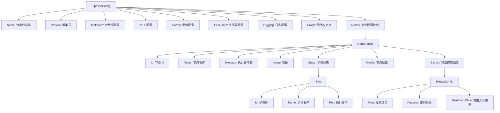
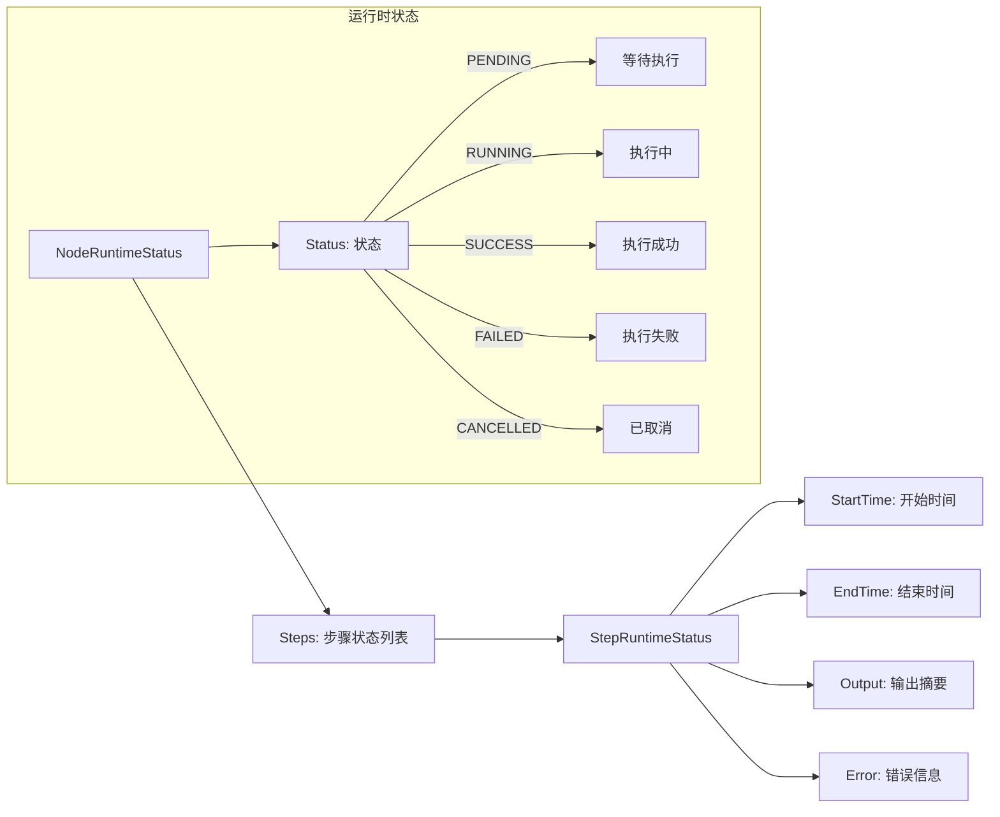

# Core 模块流程图

## 配置结构流程

```mermaid
flowchart TD
    A[PipelineConfig] --> B[Name: 流水线名称]
    A --> C[Version: 版本号]
    A --> D[Metadate: 元数据配置]
    A --> E[AI: AI配置]
    A --> F[Param: 参数配置]
    A --> G[Executors: 执行器配置]
    A --> H[Logging: 日志配置]
    A --> I[Graph: 图结构定义]
    A --> J[Nodes: 节点配置映射]

    J --> K[NodeConfig]
    K --> L[Id: 节点ID]
    K --> M[Name: 节点名称]
    K --> N[Executor: 执行器名称]
    K --> O[Image: 镜像]
    K --> P[Steps: 步骤列表]
    K --> Q[Config: 节点配置]
    K --> R[Extract: 输出提取配置]

    P --> S[Step]
    S --> T[Id: 步骤ID]
    S --> U[Name: 步骤名称]
    S --> V[Run: 执行命令]

    R --> W[ExtractConfig]
    W --> X[Type: 提取类型]
    W --> Y[Patterns: 正则模式]
    W --> Z[MaxOutputSize: 输出大小限制]
```

## 运行时状态流程

```mermaid
flowchart LR
    subgraph 运行时状态
    A[NodeRuntimeStatus] --> B[Status: 状态]
    B --> |PENDING| C[等待执行]
    B --> |RUNNING| D[执行中]
    B --> |SUCCESS| E[执行成功]
    B --> |FAILED| F[执行失败]
    B --> |CANCELLED| G[已取消]
    end

    A --> H[Steps: 步骤状态列表]
    H --> I[StepRuntimeStatus]
    I --> J[StartTime: 开始时间]
    I --> K[EndTime: 结束时间]
    I --> L[Output: 输出摘要]
    I --> M[Error: 错误信息]
```