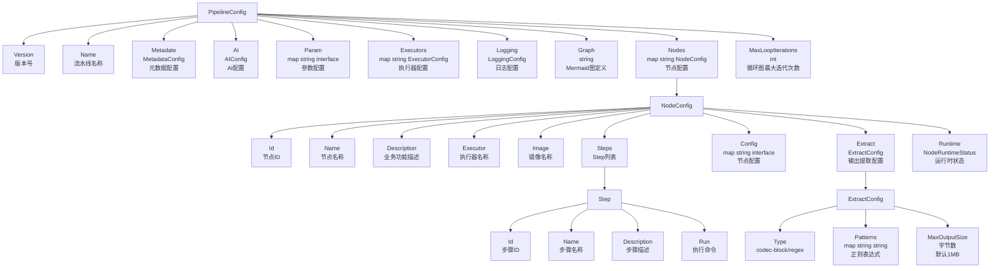
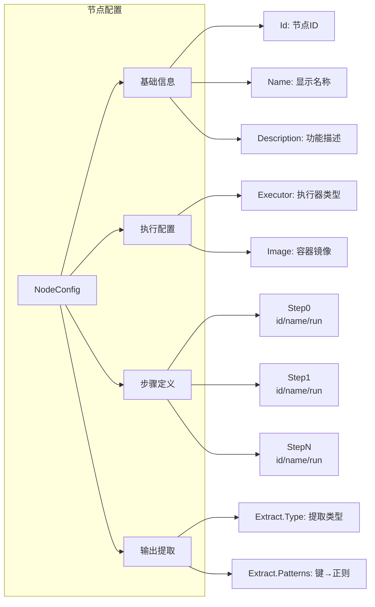
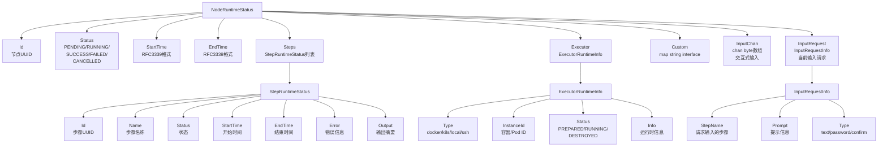
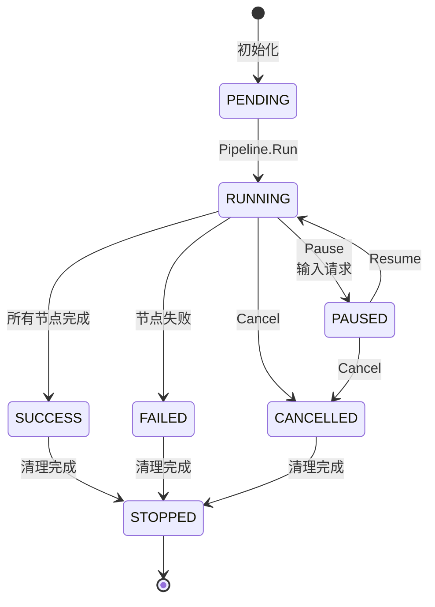
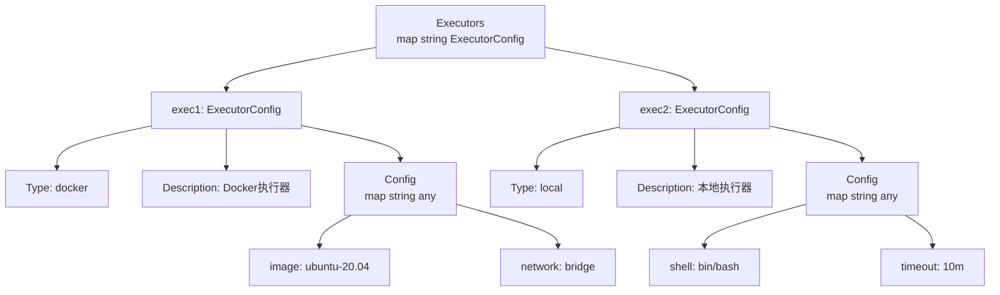
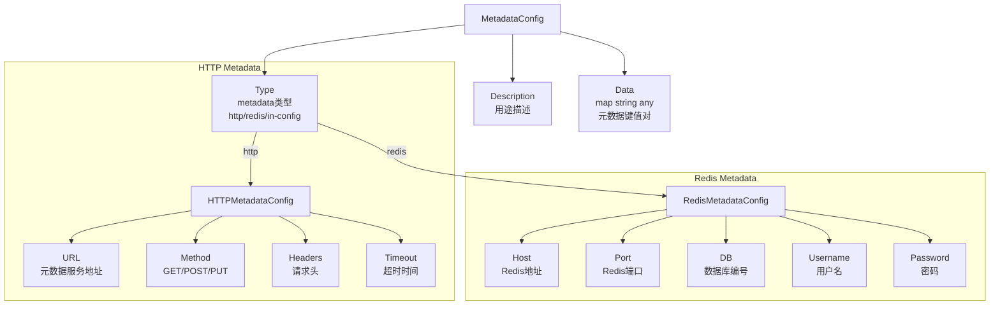
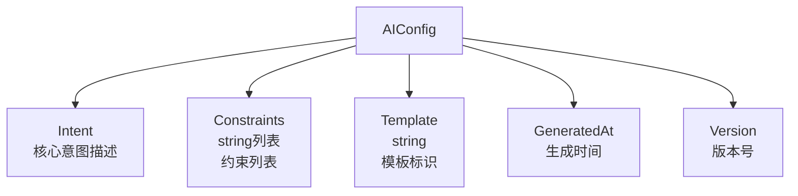
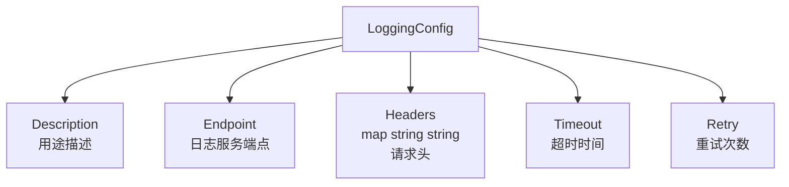
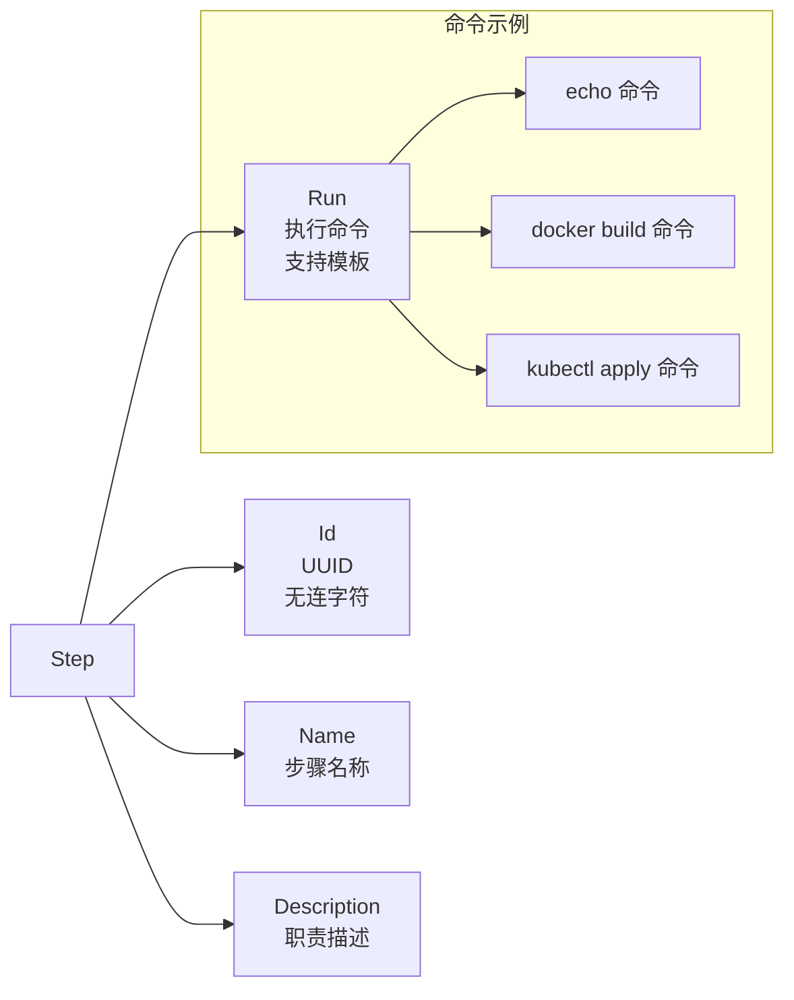
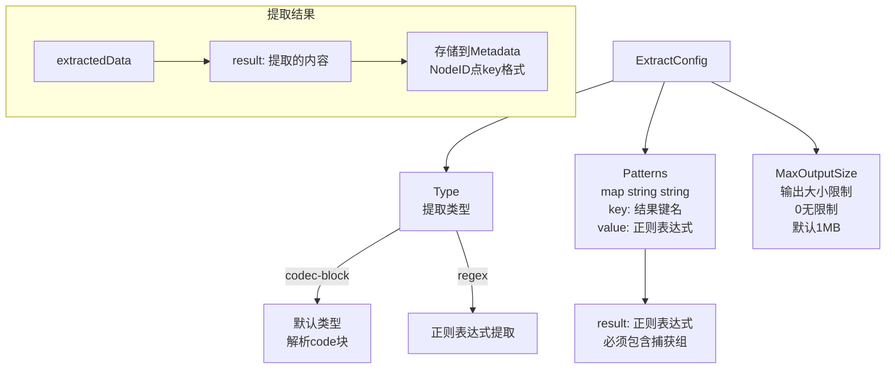

# Core 模块流程图

## PipelineConfig 配置结构

```mermaid
flowchart TD
    A[PipelineConfig] --> B[Version<br/>版本号]
    A --> C[Name<br/>流水线名称]
    A --> D[Metadate<br/>MetadataConfig<br/>元数据配置]
    A --> E[AI<br/>AIConfig<br/>AI配置]
    A --> F[Param<br/>map string interface<br/>参数配置]
    A --> G[Executors<br/>map string ExecutorConfig<br/>执行器配置]
    A --> H[Logging<br/>LoggingConfig<br/>日志配置]
    A --> I[Graph<br/>string<br/>Mermaid图定义]
    A --> J[Nodes<br/>map string NodeConfig<br/>节点配置]
    A --> K[MaxLoopIterations<br/>int<br/>循环图最大迭代次数]

    J --> L[NodeConfig]
    L --> M[Id<br/>节点ID]
    L --> N[Name<br/>节点名称]
    L --> O[Description<br/>业务功能描述]
    L --> P[Executor<br/>执行器名称]
    L --> Q[Image<br/>镜像名称]
    L --> R[Steps<br/>Step列表]
    L --> S[Config<br/>map string interface<br/>节点配置]
    L --> T[Extract<br/>ExtractConfig<br/>输出提取配置]
    L --> U[Runtime<br/>NodeRuntimeStatus<br/>运行时状态]

    R --> V[Step]
    V --> W[Id<br/>步骤ID]
    V --> X[Name<br/>步骤名称]
    V --> Y[Description<br/>步骤描述]
    V --> Z[Run<br/>执行命令]

    T --> AA[ExtractConfig]
    AA --> AB[Type<br/>codec-block/regex]
    AA --> AC[Patterns<br/>map string string<br/>正则表达式]
    AA --> AD[MaxOutputSize<br/>字节数<br/>默认1MB]
```

## NodeConfig 节点配置

```mermaid
flowchart LR
    subgraph 节点配置
    A[NodeConfig] --> B[基础信息]
    A --> C[执行配置]
    A --> D[步骤定义]
    A --> E[输出提取]
    end

    B --> B1[Id: 节点ID]
    B --> B2[Name: 显示名称]
    B --> B3[Description: 功能描述]

    C --> C1[Executor: 执行器类型]
    C --> C2[Image: 容器镜像]

    D --> D1[Step0<br/>id/name/run]
    D --> D2[Step1<br/>id/name/run]
    D --> D3[StepN<br/>id/name/run]

    E --> E1[Extract.Type: 提取类型]
    E --> E2[Extract.Patterns: 键→正则]
```

## 运行时状态结构

```mermaid
flowchart TD
    A[NodeRuntimeStatus] --> B[Id<br/>节点UUID]
    A --> C[Status<br/>PENDING/RUNNING/<br/>SUCCESS/FAILED/<br/>CANCELLED]
    A --> D[StartTime<br/>RFC3339格式]
    A --> E[EndTime<br/>RFC3339格式]
    A --> F[Steps<br/>StepRuntimeStatus列表]
    A --> G[Executor<br/>ExecutorRuntimeInfo]
    A --> H[Custom<br/>map string interface]
    A --> I[InputChan<br/>chan byte数组<br/>交互式输入]
    A --> J[InputRequest<br/>InputRequestInfo<br/>当前输入请求]

    F --> K[StepRuntimeStatus]
    K --> L[Id<br/>步骤UUID]
    K --> M[Name<br/>步骤名称]
    K --> N[Status<br/>状态]
    K --> O[StartTime<br/>开始时间]
    K --> P[EndTime<br/>结束时间]
    K --> Q[Error<br/>错误信息]
    K --> R[Output<br/>输出摘要]

    G --> S[ExecutorRuntimeInfo]
    S --> T[Type<br/>docker/k8s/local/ssh]
    S --> U[InstanceId<br/>容器/Pod ID]
    S --> V[Status<br/>PREPARED/RUNNING/<br/>DESTROYED]
    S --> W[Info<br/>运行时信息]

    J --> X[InputRequestInfo]
    X --> Y[StepName<br/>请求输入的步骤]
    X --> Z[Prompt<br/>提示信息]
    X --> AA[Type<br/>text/password/confirm]
```

## 状态流转

```mermaid
stateDiagram-v2
    [*] --> PENDING: 初始化

    PENDING --> RUNNING: Pipeline.Run

    RUNNING --> PAUSED: Pause<br/>输入请求

    PAUSED --> RUNNING: Resume

    RUNNING --> SUCCESS: 所有节点完成
    RUNNING --> FAILED: 节点失败
    RUNNING --> CANCELLED: Cancel

    PAUSED --> CANCELLED: Cancel

    SUCCESS --> STOPPED: 清理完成
    FAILED --> STOPPED: 清理完成
    CANCELLED --> STOPPED: 清理完成

    STOPPED --> [*]
```

## 执行器配置

```mermaid
flowchart TD
    A[Executors<br/>map string ExecutorConfig]

    A --> B[exec1: ExecutorConfig]
    A --> C[exec2: ExecutorConfig]

    B --> D[Type: docker]
    B --> E[Description: Docker执行器]
    B --> F[Config<br/>map string any]
    F --> G[image: ubuntu-20.04]
    F --> H[network: bridge]

    C --> I[Type: local]
    C --> J[Description: 本地执行器]
    C --> K[Config<br/>map string any]
    K --> L[shell: bin/bash]
    K --> M[timeout: 10m]
```

## 元数据配置

```mermaid
flowchart TD
    A[MetadataConfig] --> B[Type<br/>metadata类型<br/>http/redis/in-config]
    A --> C[Description<br/>用途描述]
    A --> D[Data<br/>map string any<br/>元数据键值对]

    subgraph HTTP Metadata
    B -->|"http"| E[HTTPMetadataConfig]
    E --> F[URL<br/>元数据服务地址]
    E --> G[Method<br/>GET/POST/PUT]
    E --> H[Headers<br/>请求头]
    E --> I[Timeout<br/>超时时间]
    end

    subgraph Redis Metadata
    B -->|"redis"| J[RedisMetadataConfig]
    J --> K[Host<br/>Redis地址]
    J --> L[Port<br/>Redis端口]
    J --> M[DB<br/>数据库编号]
    J --> N[Username<br/>用户名]
    J --> O[Password<br/>密码]
    end
```

## AI配置

```mermaid
flowchart TD
    A[AIConfig] --> B[Intent<br/>核心意图描述]
    A --> C[Constraints<br/>string列表<br/>约束列表]
    A --> D[Template<br/>string<br/>模板标识]
    A --> E[GeneratedAt<br/>生成时间]
    A --> F[Version<br/>版本号]
```

## 日志配置

```mermaid
flowchart TD
    A[LoggingConfig] --> B[Description<br/>用途描述]
    A --> C[Endpoint<br/>日志服务端点]
    A --> D[Headers<br/>map string string<br/>请求头]
    A --> E[Timeout<br/>超时时间]
    A --> F[Retry<br/>重试次数]
```

## Step 步骤结构

```mermaid
flowchart LR
    A[Step] --> B[Id<br/>UUID<br/>无连字符]
    A --> C[Name<br/>步骤名称]
    A --> D[Description<br/>职责描述]
    A --> E[Run<br/>执行命令<br/>支持模板]

    subgraph 命令示例
    E --> F[echo 命令]
    E --> G[docker build 命令]
    E --> H[kubectl apply 命令]
    end
```

## ExtractConfig 输出提取

```mermaid
flowchart TD
    A[ExtractConfig] --> B[Type<br/>提取类型]
    B --> |codec-block| C[默认类型<br/>解析code块]
    B --> |regex| D[正则表达式提取]

    A --> E[Patterns<br/>map string string<br/>key: 结果键名<br/>value: 正则表达式]

    E --> F[result: 正则表达式<br/>必须包含捕获组]

    A --> G[MaxOutputSize<br/>输出大小限制<br/>0无限制<br/>默认1MB]

    subgraph 提取结果
    H[extractedData] --> I[result: 提取的内容]
    I --> J[存储到Metadata<br/>NodeID点key格式]
    end
```