# DAG 模块流程图

## 图结构

```mermaid
flowchart TD
    subgraph DGAGraph核心结构
    A[DGAGraph] --> B[nodes<br/>map[string]Node]
    A --> C[edges<br/>map[string]Edge]
    A --> D[graph<br/>map[string][]string<br/>邻接表]
    A --> E[edgeMap<br/>map[string]map[string]Edge<br/>源→目标→边]
    A --> F[sequence<br/>[]string]
    A --> G[hasCycle<br/>bool]
    A --> H[backEdges<br/>map[string]bool<br/>被接受的回边]
    A --> I[entryNodes<br/>map[string]bool<br/>入口节点]
    A --> J[exitNodes<br/>map[string]bool<br/>出口节点]
    end

    B --> K[Node接口]
    K --> L[Id: string]
    K --> M[Name: string]
    K --> N[GetExecutor: string]
    K --> O[GetSteps: []core.Step]
    K --> P[GetRuntimeStatus: *NodeRuntimeStatus]
    K --> Q[SetRuntimeStatus]
    K --> R[EnsureIds]
```

## 边类型

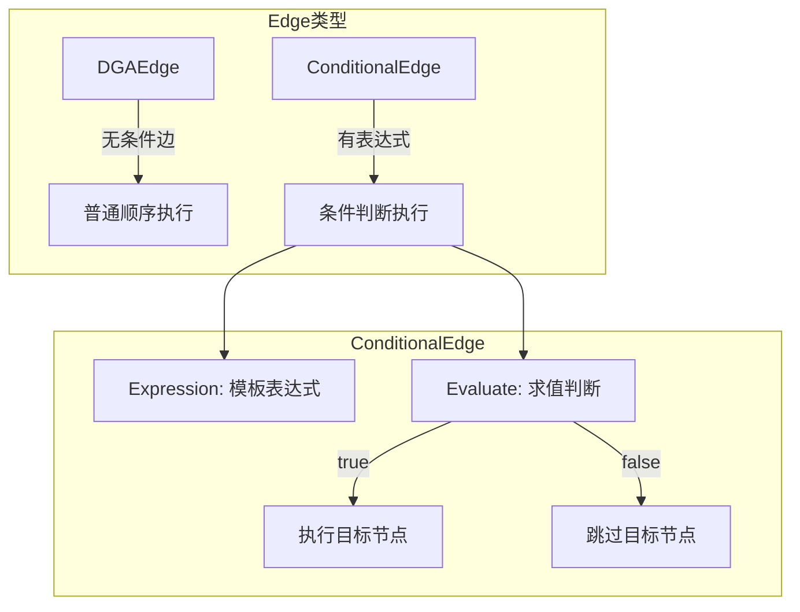

## Pipeline.Run 完整执行流程

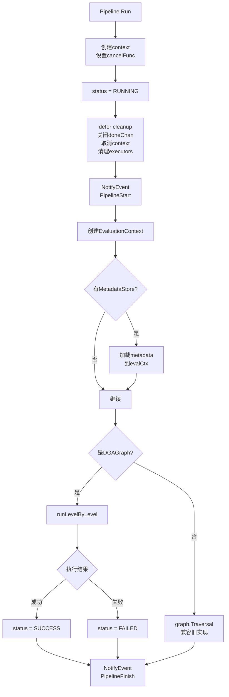

## runLevelByLevel 逐层执行（核心）

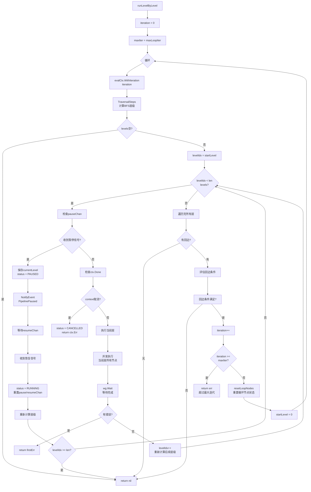

## executeNodeWithLifecycle 节点生命周期

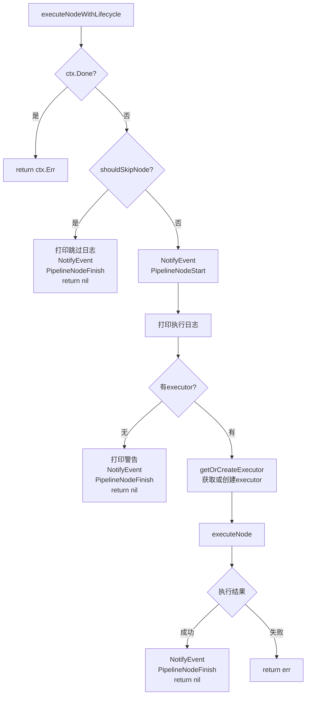

## executeNode 单节点执行

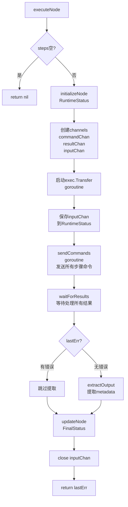

## sendCommands 发送命令

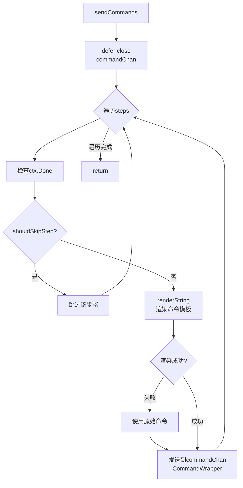

## waitForResults 等待结果

```mermaid
flowchart TD
    A[waitForResults] --> B[计算期望结果数<br/>跳过已完成的步骤]
    B --> C{resultCount <<br/>expectedResults?}
    C -->|是| D[select]
    C -->|否| Z[return<br/>lastErr, output]

    D --> E{ctx.Done?}
    E -->|是| F[handleCancellation<br/>return ctx.Err]
    E -->|否| G{resultChan关闭?}
    G -->|是| Z
    G -->|否| H[handleResult<br/>处理结果]

    H --> I{result类型}
    I -->|error| J[记录错误]
    I -->|StepResult| K[更新步骤状态]
    I -->|[]byte| L[实时输出<br/>pusher.Push]
    I -->|InputRequestEvent| M[handleInputRequest]
    I -->|InputReadyEvent| N[忽略]

    J --> O[resultCount++]
    K --> O
    L --> O
    M --> O
    O --> C
```

## handleInputRequest 输入请求处理

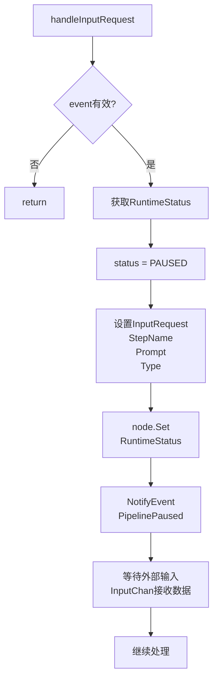

## 循环图执行流程

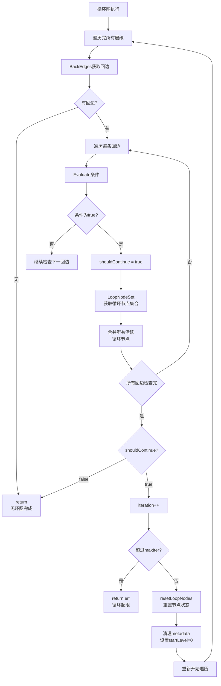

## resetLoopNodes 重置循环节点

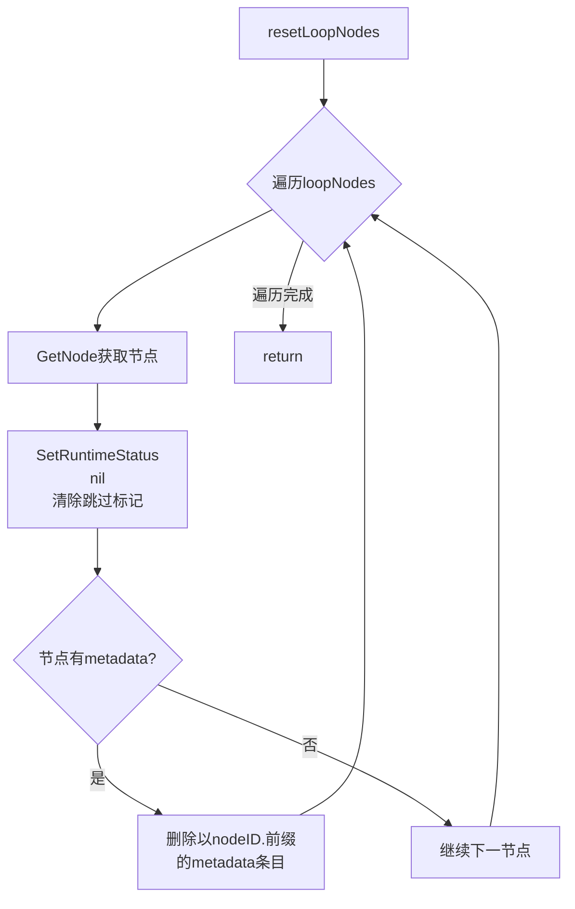

## 图构建流程

```mermaid
flowchart TD
    A[buildGraph] --> B[NewDGAGraph]
    B --> C{遍历config.Nodes}
    C --> D[创建DGANode<br/>包含executor<br/>steps等]
    D --> E[AddVertex<br/>添加到图]
    E --> C

    C -->|完成| F{config.Graph<br/>有定义?}
    F -->|否| Z[return graph]
    F -->|是| G[parseGraphEdges<br/>解析图边关系]

    G --> H[使用mermaid-check<br/>解析器]
    H --> I[遍历Statements]
    I --> J{是Transition?}
    J -->|是| K[处理入口节点<br/>[*] --> X]
    K --> L[处理出口节点<br/>X --> [*]]
    L --> M[提取条件表达式]
    M --> N{有条件?}
    N -->|是| O[NewConditionalEdge]
    N -->|否| P[NewDGAEdge]
    O --> Q[AddEdge]
    P --> Q
    Q --> I
```

## 事件系统

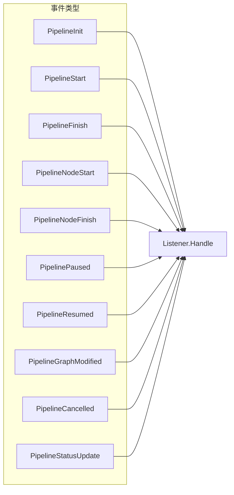

## 状态流转

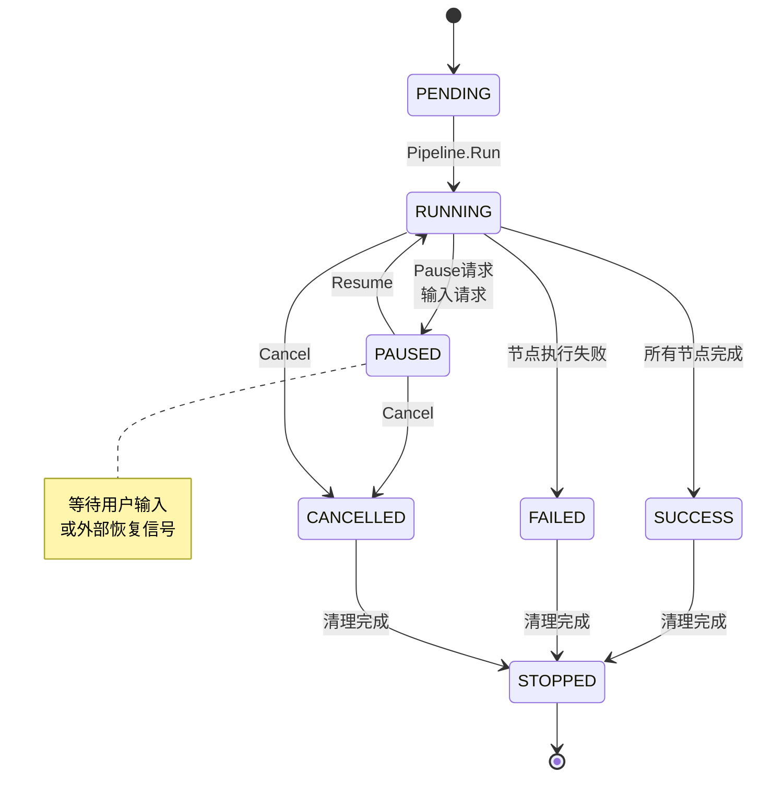

## 暂停恢复机制

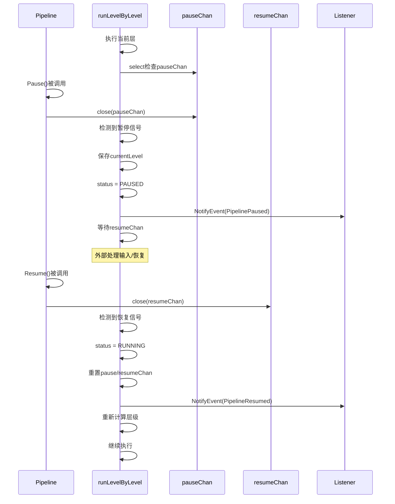