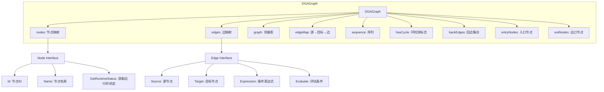
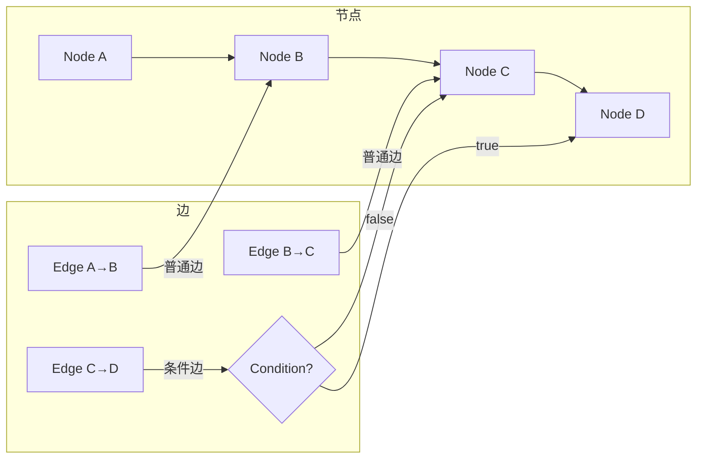
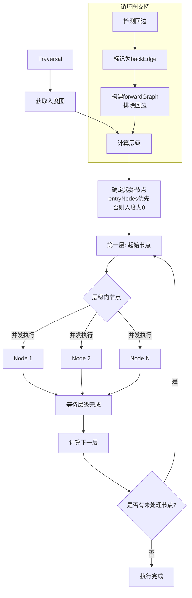
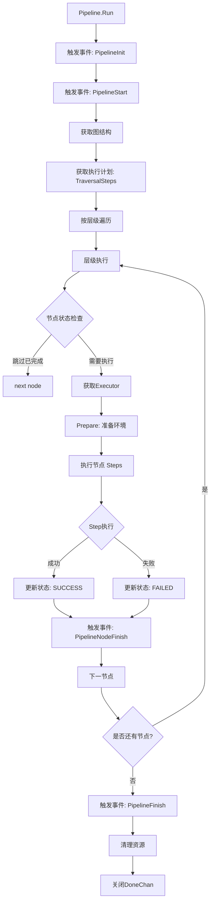
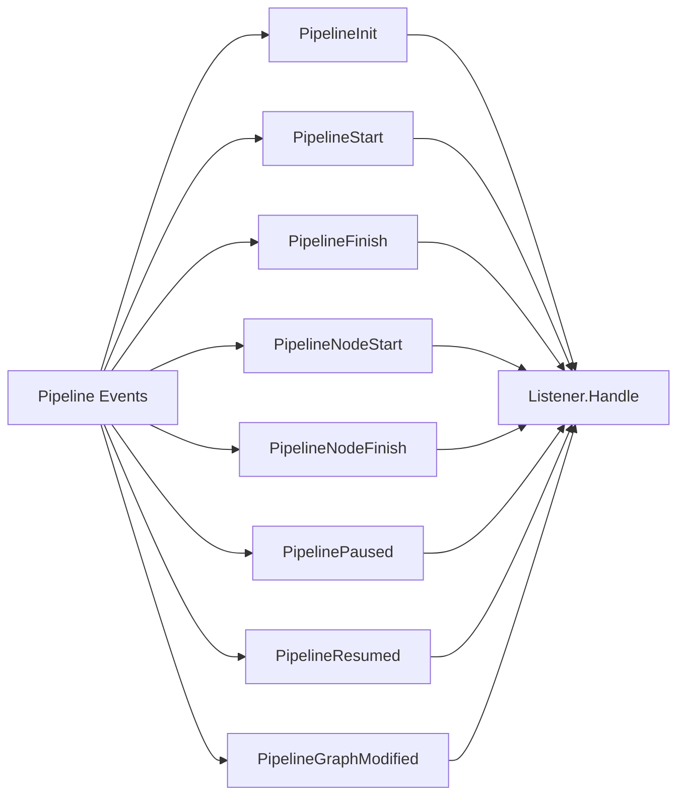
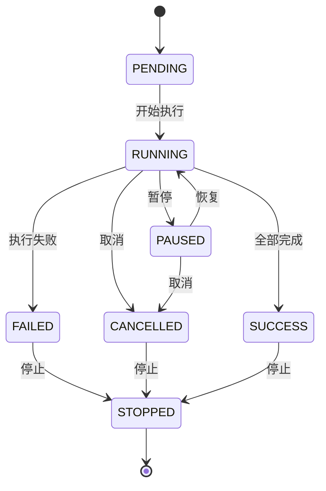

# DAG 模块流程图

## 图结构与执行流程

```mermaid
flowchart TD
    subgraph DGAGraph
    A[DGAGraph] --> B[nodes: 节点映射]
    A --> C[edges: 边映射]
    A --> D[graph: 邻接表]
    A --> E[edgeMap: 源→目标→边]
    A --> F[sequence: 序列]
    A --> G[hasCycle: 环检测标志]
    A --> H[backEdges: 回边集合]
    A --> I[entryNodes: 入口节点]
    A --> J[exitNodes: 出口节点]
    end

    B --> K[Node Interface]
    K --> L[Id: 节点ID]
    K --> M[Name: 节点名称]
    K --> N[GetRuntimeStatus: 获取运行时状态]

    C --> O[Edge Interface]
    O --> P[Source: 源节点]
    O --> Q[Target: 目标节点]
    O --> R[Expression: 条件表达式]
    O --> S[Evaluate: 评估条件]
```

## 边与节点关系

```mermaid
flowchart LR
    subgraph 节点
    N1[Node A] --> N2[Node B]
    N2 --> N3[Node C]
    N3 --> N4[Node D]
    end

    subgraph 边
    E1[Edge A→B] --> |普通边| N2
    E2[Edge B→C] --> |普通边| N3
    E3[Edge C→D] --> |条件边| D{Condition?}
    D -->|true| N4
    D -->|false| N3
    end
```

## 遍历层级执行流程

```mermaid
flowchart TD
    A[Traversal] --> B[获取入度图]
    B --> C[计算层级]
    C --> D[确定起始节点<br/>entryNodes优先<br/>否则入度为0]

    D --> E[第一层: 起始节点]
    E --> F{层级内节点}
    F -->|并发执行| G[Node 1]
    F -->|并发执行| H[Node 2]
    F -->|并发执行| I[Node N]

    G --> J[等待层级完成]
    H --> J
    I --> J

    J --> K[计算下一层]
    K --> L{是否有未处理节点?}
    L -->|是| E
    L -->|否| M[执行完成]

    subgraph 循环图支持
    N[检测回边] --> O[标记为backEdge]
    O --> P[构建forwardGraph<br/>排除回边]
    P --> C
    end
```

## Pipeline 执行流程

```mermaid
flowchart TD
    A[Pipeline.Run] --> B[触发事件: PipelineInit]
    B --> C[触发事件: PipelineStart]

    C --> D[获取图结构]
    D --> E[获取执行计划: TraversalSteps]
    E --> F[按层级遍历]

    F --> G[层级执行]
    G --> H{节点状态检查}
    H -->|跳过已完成| I[next node]
    H -->|需要执行| J[获取Executor]

    J --> K[Prepare: 准备环境]
    K --> L[执行节点 Steps]
    L --> M{Step执行}

    M -->|成功| N[更新状态: SUCCESS]
    M -->|失败| O[更新状态: FAILED]

    N --> P[触发事件: PipelineNodeFinish]
    O --> P

    P --> Q[下一节点]
    Q --> R{是否还有节点?}
    R -->|是| G
    R -->|否| S[触发事件: PipelineFinish]

    S --> T[清理资源]
    T --> U[关闭DoneChan]
```

## 事件监听流程

```mermaid
flowchart LR
    A[Pipeline Events] --> B[PipelineInit]
    A --> C[PipelineStart]
    A --> D[PipelineFinish]
    A --> E[PipelineNodeStart]
    A --> F[PipelineNodeFinish]
    A --> G[PipelinePaused]
    A --> H[PipelineResumed]
    A --> I[PipelineGraphModified]

    B --> J[Listener.Handle]
    C --> J
    D --> J
    E --> J
    F --> J
    G --> J
    H --> J
    I --> J
```

## 流水线状态流程

```mermaid
stateDiagram-v2
    [*] --> PENDING
    PENDING --> RUNNING: 开始执行
    RUNNING --> PAUSED: 暂停
    PAUSED --> RUNNING: 恢复
    RUNNING --> SUCCESS: 全部完成
    RUNNING --> FAILED: 执行失败
    RUNNING --> CANCELLED: 取消
    PAUSED --> CANCELLED: 取消
    FAILED --> STOPPED: 停止
    CANCELLED --> STOPPED: 停止
    SUCCESS --> STOPPED: 停止
    STOPPED --> [*]
```