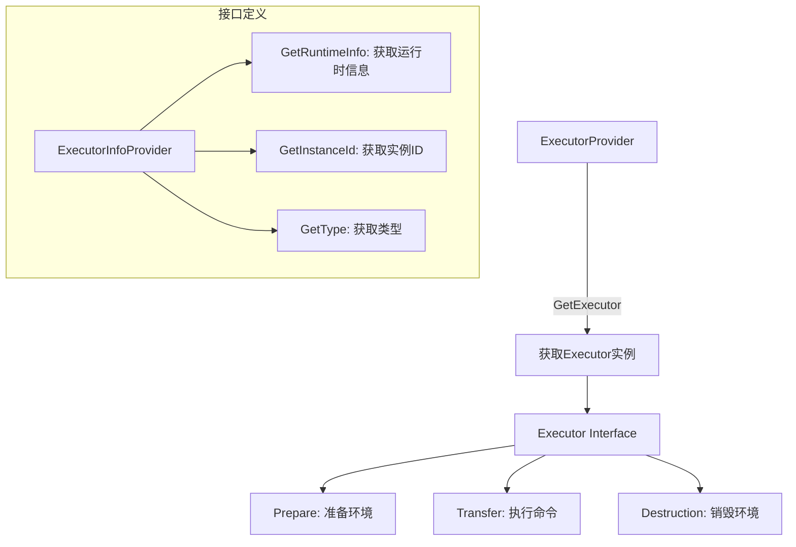
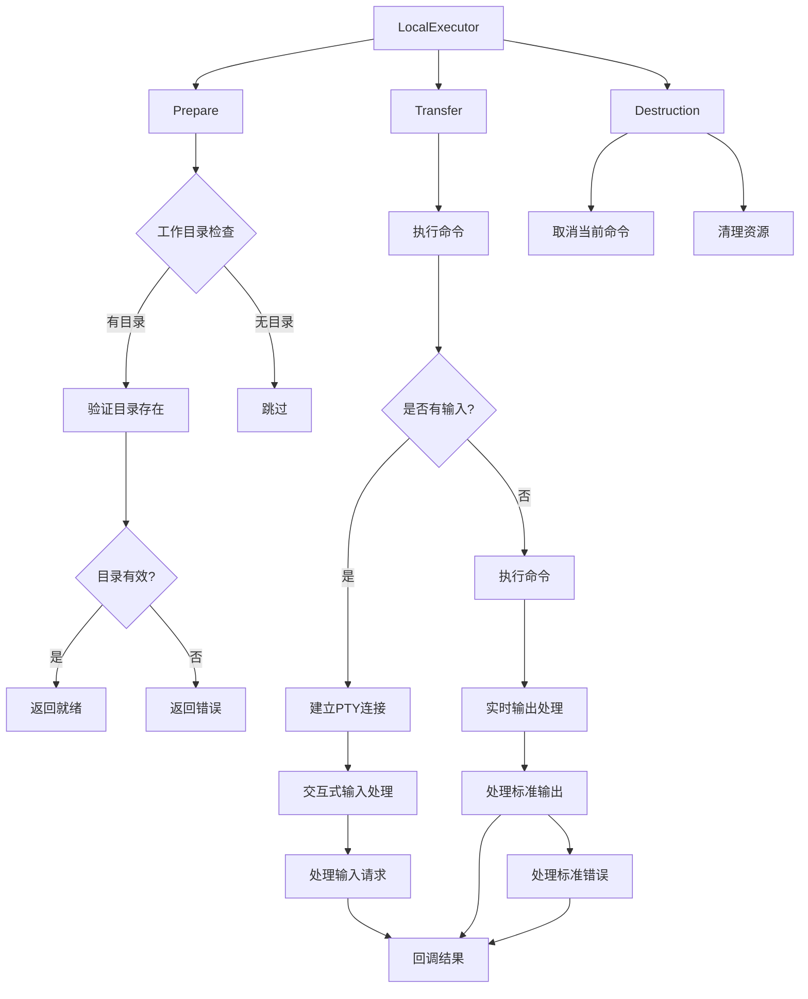
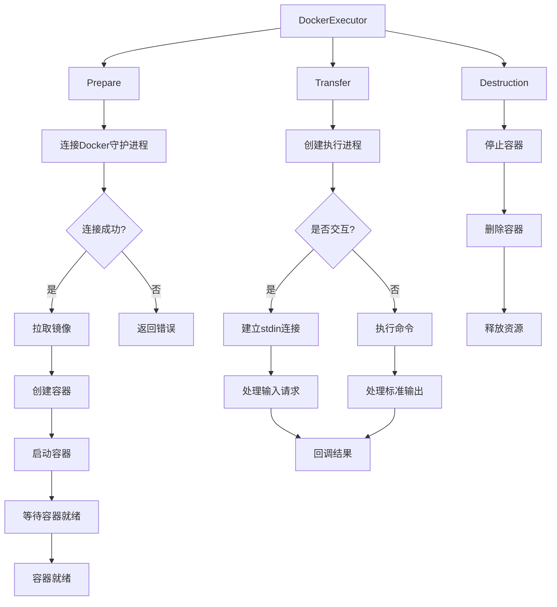
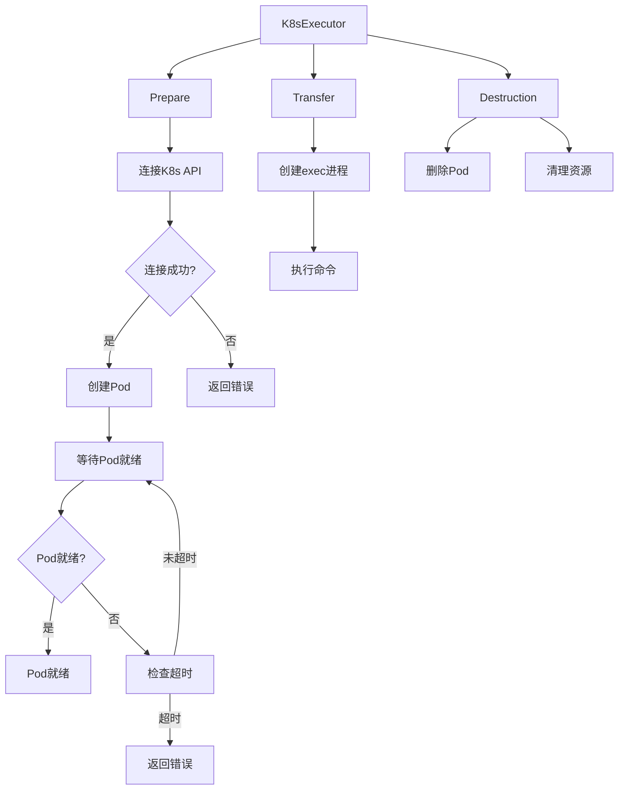
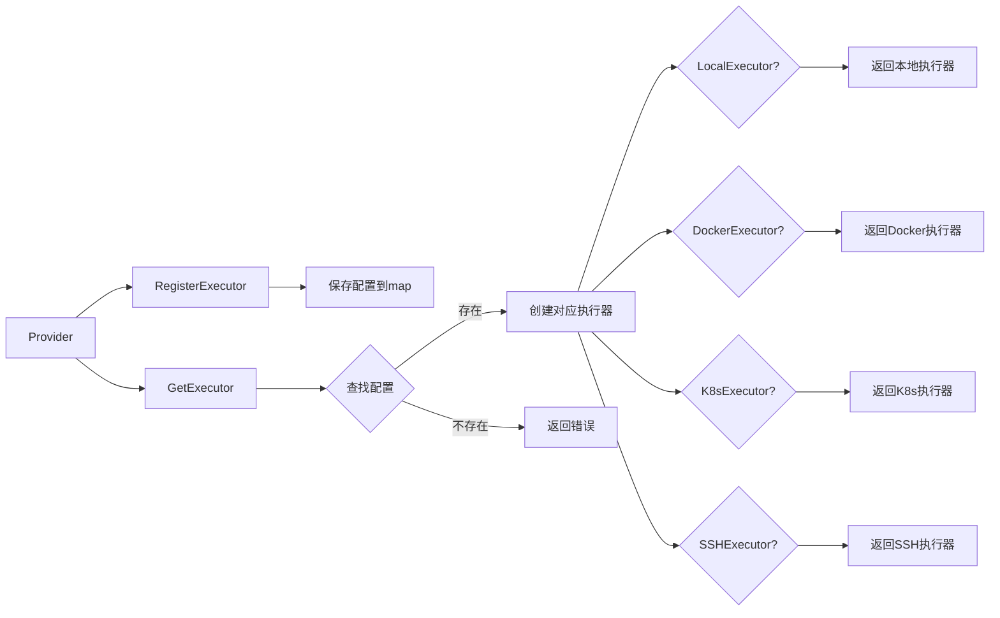
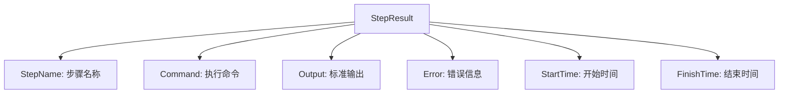
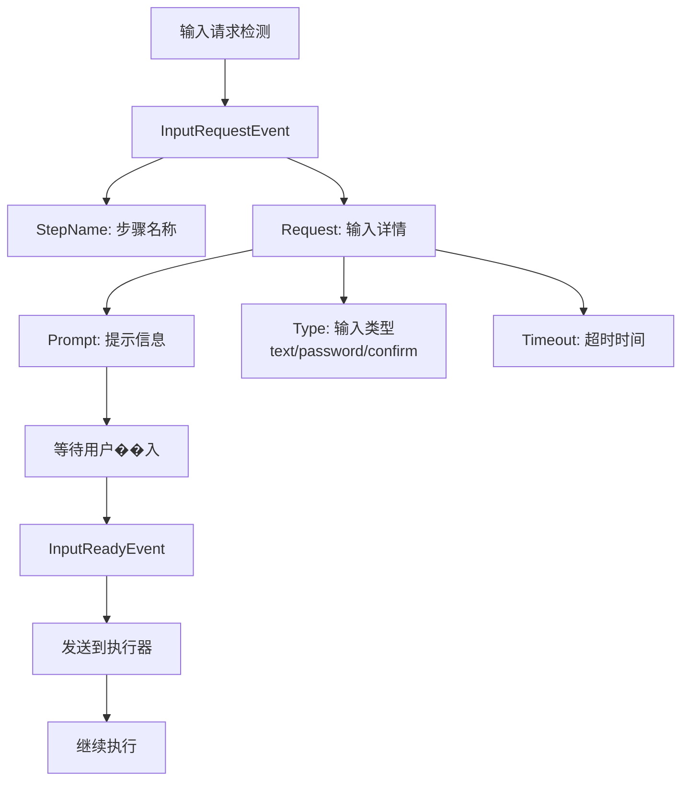

# Executor 模块流程图

## 执行器接口层次

```mermaid
flowchart TD
    A[ExecutorProvider] -->|GetExecutor| B[获取Executor实例]
    B --> C[Executor Interface]

    C --> D[Prepare: 准备环境]
    C --> E[Transfer: 执行命令]
    C --> F[Destruction: 销毁环境]

    subgraph 接口定义
    G[ExecutorInfoProvider]
    G --> H[GetRuntimeInfo: 获取运行时信息]
    G --> I[GetInstanceId: 获取实例ID]
    G --> J[GetType: 获取类型]
    end
```

## 本地执行器流程

```mermaid
flowchart TD
    A[LocalExecutor] --> B[Prepare]
    B --> C{工作目录检查}
    C -->|有目录| D[验证目录存在]
    C -->|无目录| E[跳过]
    D --> F{目录有效?}
    F -->|是| G[返回就绪]
    F -->|否| H[返回错误]

    A --> I[Transfer]
    I --> J[执行命令]
    J --> K{是否有输入?}
    K -->|是| L[建立PTY连接]
    K -->|否| M[执行命令]
    L --> N[交互式输入处理]
    M --> O[实时输出处理]

    N --> P[处理输入请求]
    O --> Q[处理标准输出]
    Q --> R[处理标准错误]

    P --> S[回调结果]
    Q --> S
    R --> S

    A --> T[Destruction]
    T --> U[取消当前命令]
    T --> V[清理资源]
```

## Docker执行器流程

```mermaid
flowchart TD
    A[DockerExecutor] --> B[Prepare]
    B --> C[连接Docker守护进程]
    C --> D{连接成功?}
    D -->|是| E[拉取镜像]
    D -->|否| F[返回错误]

    E --> G[创建容器]
    G --> H[启动容器]
    H --> I[等待容器就绪]
    I --> J[容器就绪]

    A --> K[Transfer]
    K --> L[创建执行进程]
    L --> M{是否交互?}
    M -->|是| N[建立stdin连接]
    M -->|否| O[执行命令]

    N --> P[处理输入请求]
    O --> Q[处理标准输出]

    P --> R[回调结果]
    Q --> R

    A --> S[Destruction]
    S --> T[停止容器]
    T --> U[删除容器]
    U --> V[释放资源]
```

## Kubernetes执行器流程

```mermaid
flowchart TD
    A[K8sExecutor] --> B[Prepare]
    B --> C[连接K8s API]
    C --> D{连接成功?}
    D -->|是| E[创建Pod]
    D -->|否| F[返回错误]

    E --> G[等待Pod就绪]
    G --> H{Pod就绪?}
    H -->|是| I[Pod就绪]
    H -->|否| J[检查超时]
    J -->|超时| K[返回错误]
    J -->|未超时| G

    A --> L[Transfer]
    L --> M[创建exec进程]
    M --> N[执行命令]

    A --> O[Destruction]
    O --> P[删除Pod]
    O --> Q[清理资源]
```

## 执行器Provider工厂

```mermaid
flowchart LR
    A[Provider] --> B[RegisterExecutor]
    B --> C[保存配置到map]

    A --> D[GetExecutor]
    D --> E{查找配置}
    E -->|存在| F[创建对应执行器]
    E -->|不存在| G[返回错误]

    F --> H{LocalExecutor?}
    F --> I{DockerExecutor?}
    F --> J{K8sExecutor?}
    F --> K{SSHExecutor?}

    H --> L[返回本地执行器]
    I --> M[返回Docker执行器]
    J --> N[返回K8s执行器]
    K --> O[返回SSH执行器]
```

## 命令执行结果流程

```mermaid
flowchart TD
    A[StepResult] --> B[StepName: 步骤名称]
    A --> C[Command: 执行命令]
    A --> D[Output: 标准输出]
    A --> E[Error: 错误信息]
    A --> F[StartTime: 开始时间]
    A --> G[FinishTime: 结束时间]
```

## 交互式输入流程

```mermaid
flowchart TD
    A[输入请求检测] --> B[InputRequestEvent]
    B --> C[StepName: 步骤名称]
    B --> D[Request: 输入详情]

    D --> E[Prompt: 提示信息]
    D --> F[Type: 输入类型<br/>text/password/confirm]
    D --> G[Timeout: 超时时间]

    E --> H[等待用户��入]
    H --> I[InputReadyEvent]
    I --> J[发送到执行器]
    J --> K[继续执行]
```