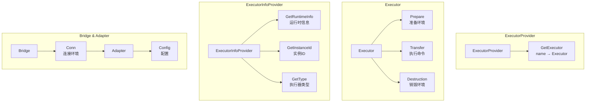
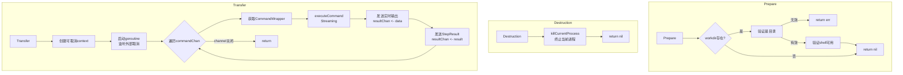
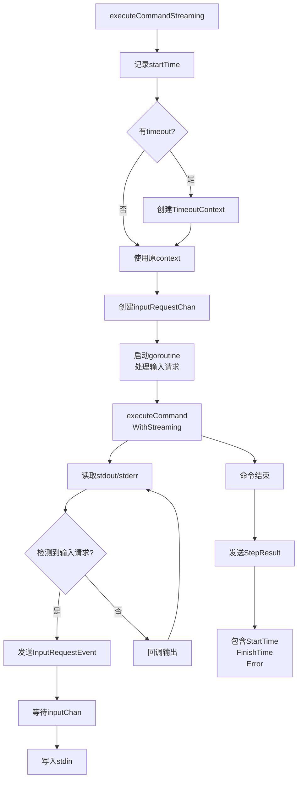
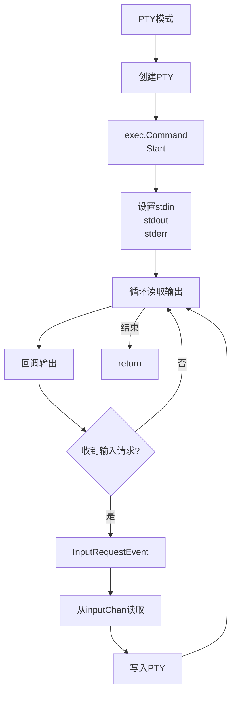
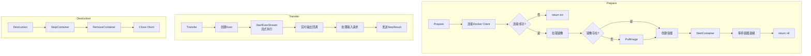
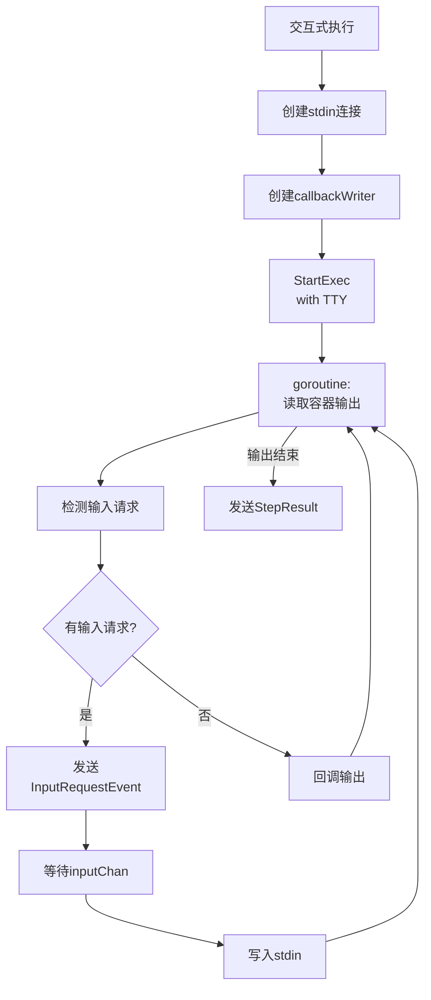
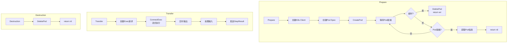
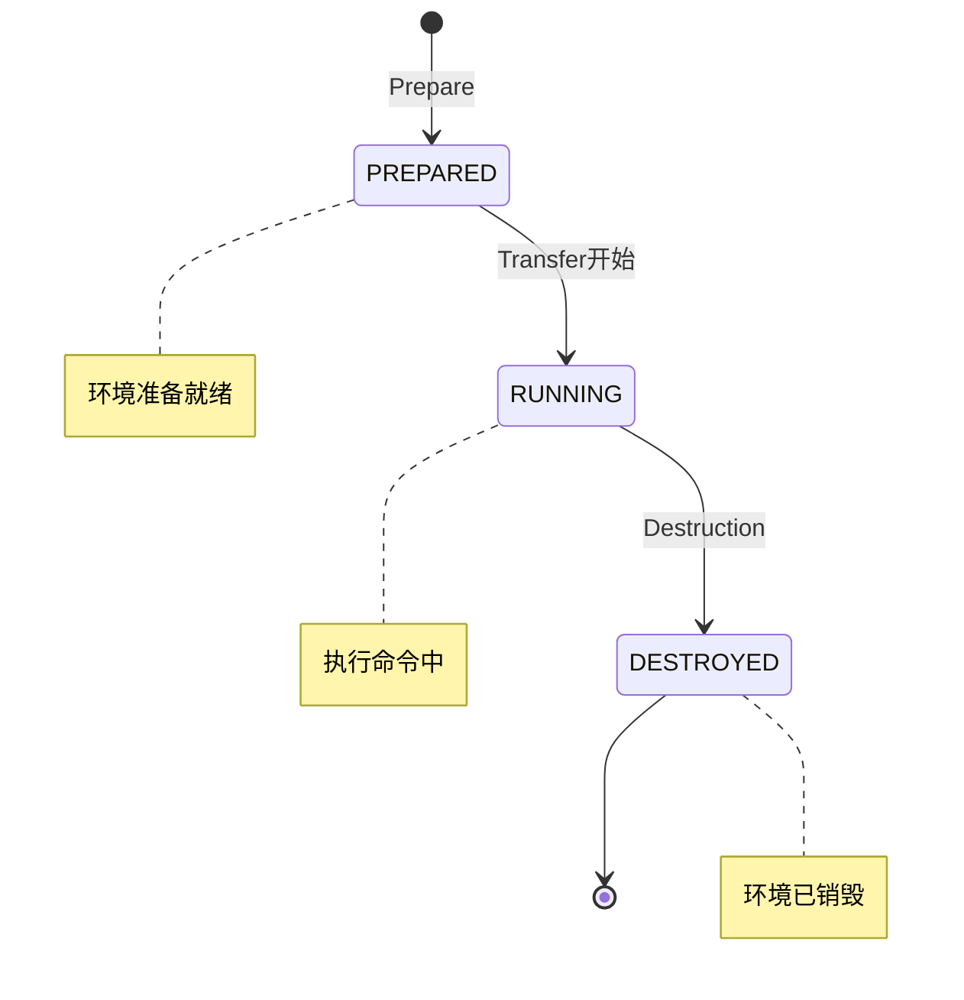
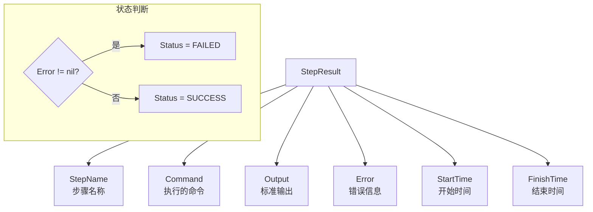
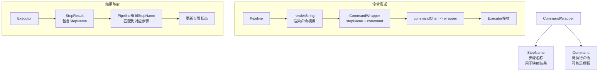

# Executor 模块流程图

## 接口层次



## ExecutorProvider 工厂

```mermaid
flowchart TD
    A[Provider] --> B[executors<br/>map string ExecutorConfig]

    A --> C[RegisterExecutor]
    C --> D[保存配置到map]

    A --> D2[GetExecutor]
    D2 --> E{查找配置}
    E -->|不存在| F[return nil<br/>err]
    E -->|存在| G{创建执行器}

    G --> H{Type is "local"}

    G --> I{Type is "docker"}

    G --> J{Type is "ssh"}

    H --> K[NewLocalExecutor]
    I --> L[NewDockerExecutor]
    J --> M[NewSSHExecutor]

    K --> N[配置执行器]
    L --> N
    M --> N
    N --> O[return executor]
```

## LocalExecutor 本地执行器



## LocalExecutor 命令执行



## LocalExecutor PTY模式



## DockerExecutor



## DockerExecutor 交互式执行



## KubernetesExecutor



## 执行器状态



## 命令执行结果



## 输入请求流程

```mermaid
flowchart TD
    A[检测到输入请求] --> B[程序输出<br/>{"flowx":"wait-input"}]
    B --> C[解析请求信息]
    C --> D[Prompt<br/>提示信息]
    C --> E[Type<br/>text/password/confirm]
    C --> F[Timeout<br/>超时时间]

    D --> G[创建<br/>InputRequestEvent]
    G --> H[发送到resultChan]
    H --> I[外部处理<br/>等待用户输入]

    I --> J[InputReadyEvent]
    J --> K[发送到inputChan]
    K --> L[继续执行]
```

## CommandWrapper 命令包装



## Provider 注册机制

```mermaid
flowchart TD
    A[RegisterExecutor] --> B[name]
    A --> C[ExecutorConfig]
    C --> D[Type: 执行器类型]
    C --> E[Config: 配置映射]
    C --> F[Description: 描述]

    B --> G[executors[name] = config]

    A2[GetExecutor] --> H{有缓存?}
    H -->|有| I[返回缓存实例]
    H -->|无| J{有配置?}
    J -->|无| K[return err]
    J -->|有| L{Type?}
    L -->|local| M[NewLocalExecutor]
    L -->|docker| N[NewDockerExecutor]
    L -->|k8s| O[NewK8sExecutor]
    L -->|ssh| P[NewSSHExecutor]
    M --> Q[Config配置]
    N --> Q
    O --> Q
    P --> Q
    Q --> R[缓存并返回]
```