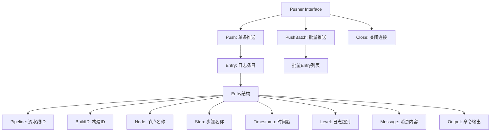
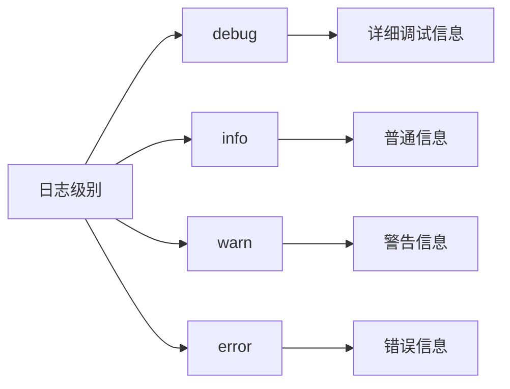
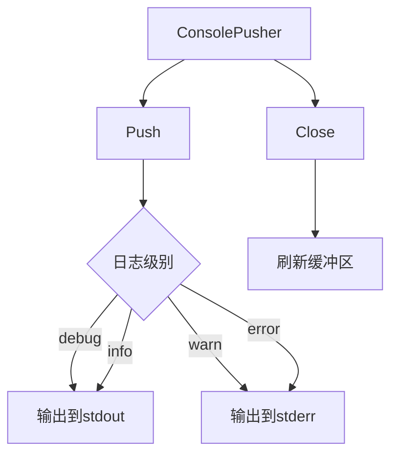

# Logger 模块流程图

## 日志推送流程

```mermaid
flowchart TD
    A[Pusher Interface] --> B[Push: 单条推送]
    A --> C[PushBatch: 批量推送]
    A --> D[Close: 关闭连接]

    B --> E[Entry: 日志条目]
    C --> F[批量Entry列表]

    E --> G[Entry结构]
    G --> H[Pipeline: 流水线ID]
    G --> I[BuildID: 构建ID]
    G --> J[Node: 节点名称]
    G --> K[Step: 步骤名称]
    G --> L[Timestamp: 时间戳]
    G --> M[Level: 日志级别]
    G --> N[Message: 消息内容]
    G --> O[Output: 命令输出]
```

## 日志级别流程

```mermaid
flowchart LR
    A[日志级别] --> B[debug]
    A --> C[info]
    A --> D[warn]
    A --> E[error]

    B --> F[详细调试信息]
    C --> G[普通信息]
    D --> H[警告信息]
    E --> I[错误信息]
```

## Console推送器流程

```mermaid
flowchart TD
    A[ConsolePusher] --> B[Push]
    B --> C{日志级别}
    C -->|debug| D[输出到stdout]
    C -->|info| D
    C -->|warn| E[输出到stderr]
    C -->|error| E

    A --> F[Close]
    F --> G[刷新缓冲区]
```