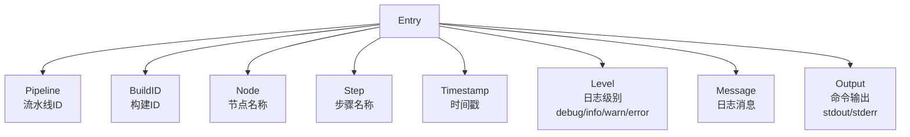
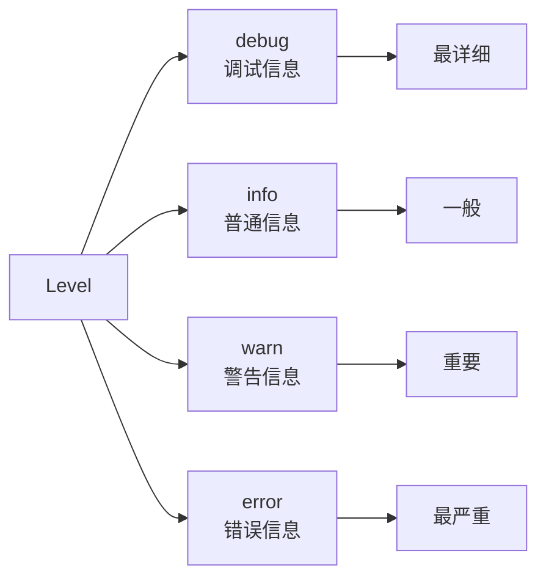
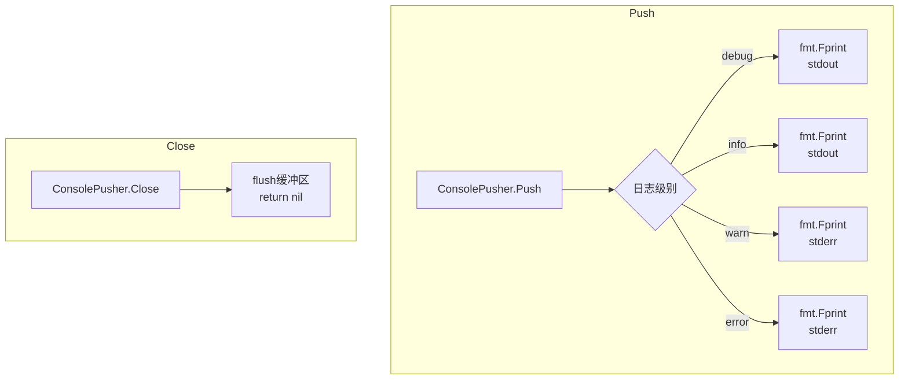
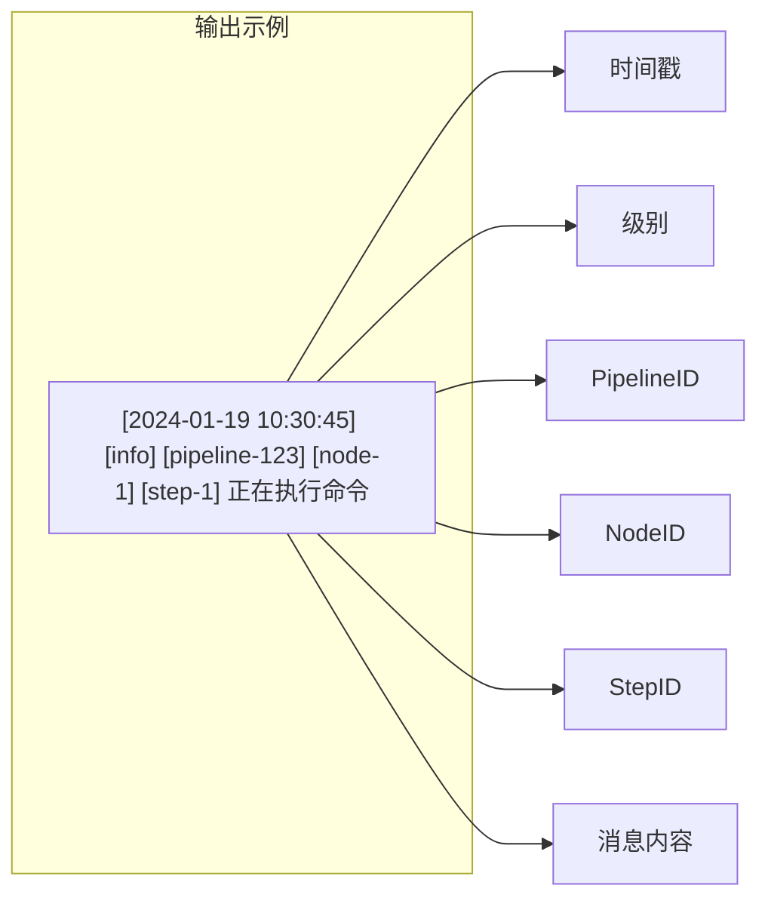
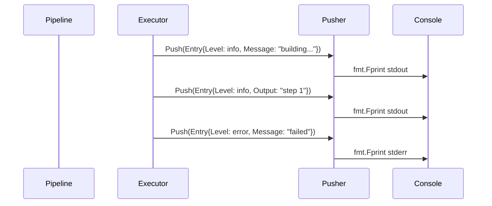
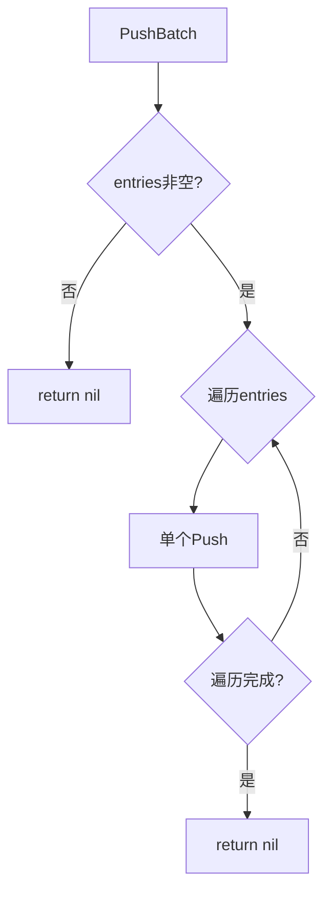

# Logger 模块流程图

## Pusher 接口

```mermaid
flowchart TD
    A[Pusher] --> B[Push<br/>ctx, Entry<br/>推送单条日志]
    A --> C[PushBatch<br/>ctx, []Entry<br/>批量推送]
    A --> D[Close<br/>关闭连接<br/>刷新缓冲]
```

## Entry 日志条目



## 日志级别



## ConsolePusher 实现



## 日志输出格式



## 日志推送流程



## 日志批量推送

