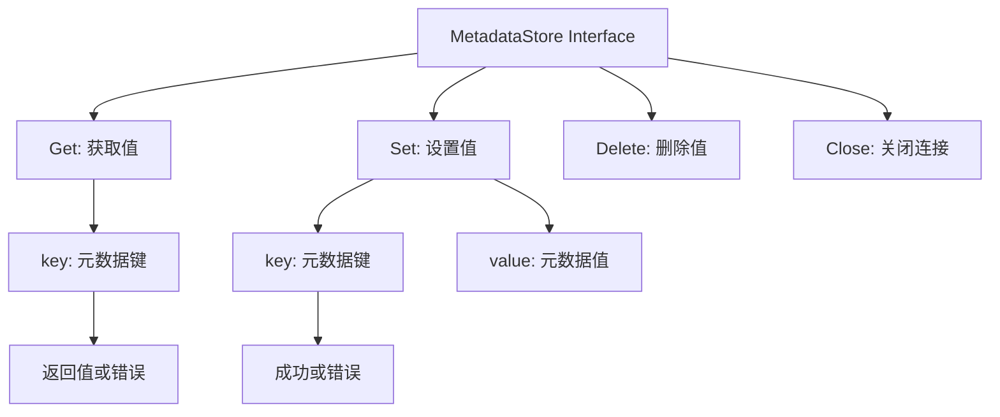
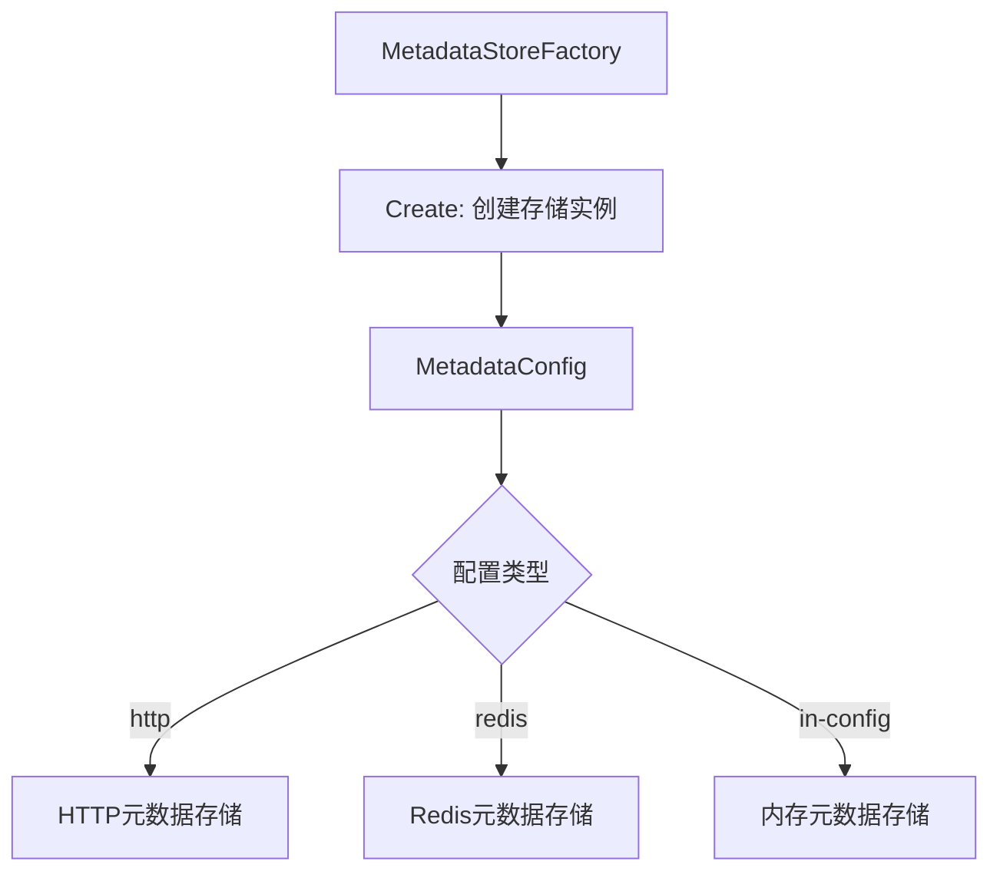

# Metadata 模块流程图

## 元数据存储流程



## 元数据工厂流程



## In-Config元数据存储流程

```mermaid
flowchart TD
    A[InConfigMetadataStore] --> B[Get]
    B --> C{查找键]
    C -->|找到| D[返回值]
    C -->|未找到| E[返回错误]

    A --> F[Set]
    F --> G[保存到内存map]

    A --> H[Delete]
    H --> I[从内存map删除]
```