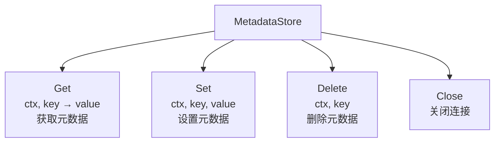
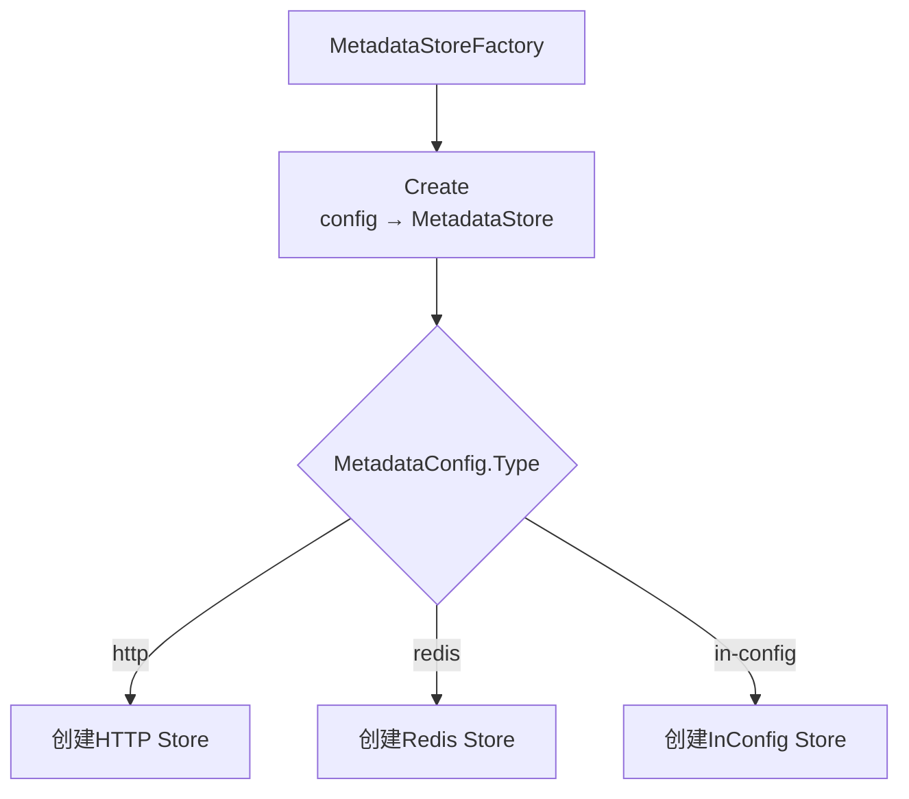
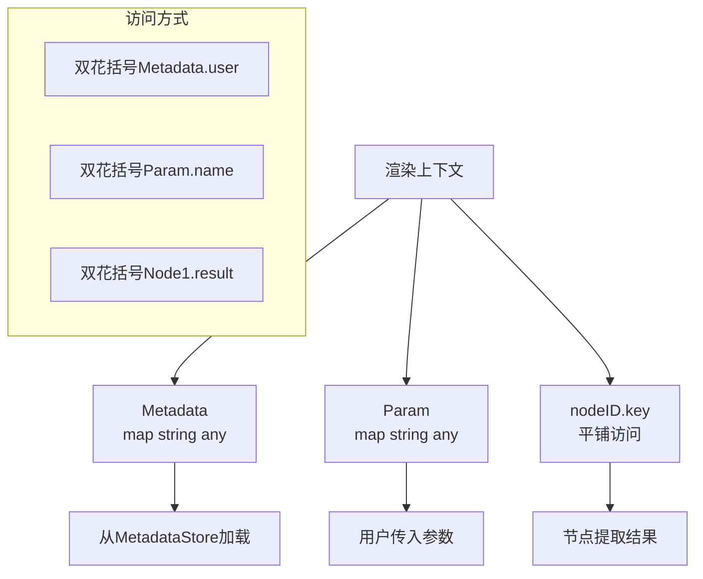
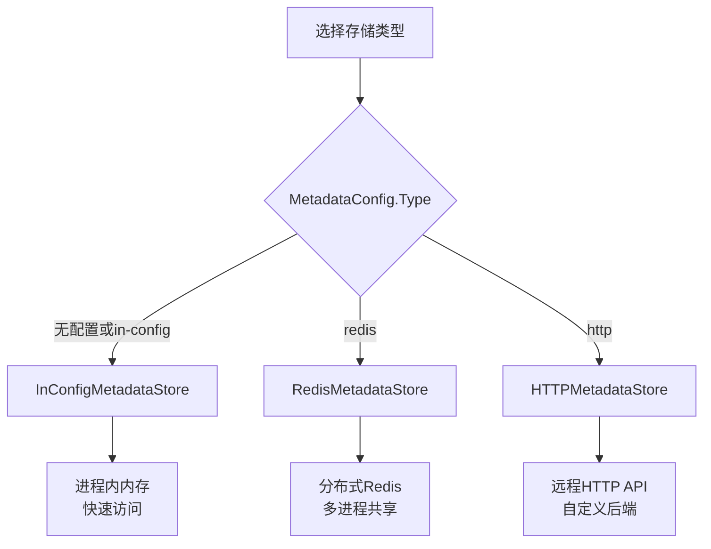

# Metadata 模块流程图

## MetadataStore 接口



## MetadataStoreFactory 工厂



## InConfigMetadataStore 内存存储

```mermaid
flowchart TD
    subgraph internal_structure["内部结构"]
    A[InConfigMetadataStore] --> B[data<br/>map string string<br/>内存存储]
    end

    subgraph get_flow["Get流程"]
    C[Get] --> D{查找key}
    D -->|找到| E[返回值]
    D -->|未找到| F[return空字符串<br/>err]
    end

    subgraph set_flow["Set流程"]
    G[Set] --> H[data[key] = value]
    H --> I[return nil]
    end

    subgraph delete_flow["Delete流程"]
    J[Delete] --> K{delete data, key}
    K --> L[return nil]
    end

    subgraph get_all["GetAll"]
    M[GetAll] --> N[返回data副本<br/>map string string]
    end
```

## 元数据访问上下文



## 元数据存储选择

