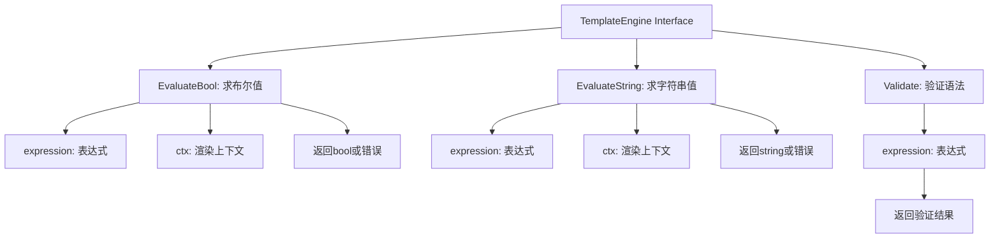
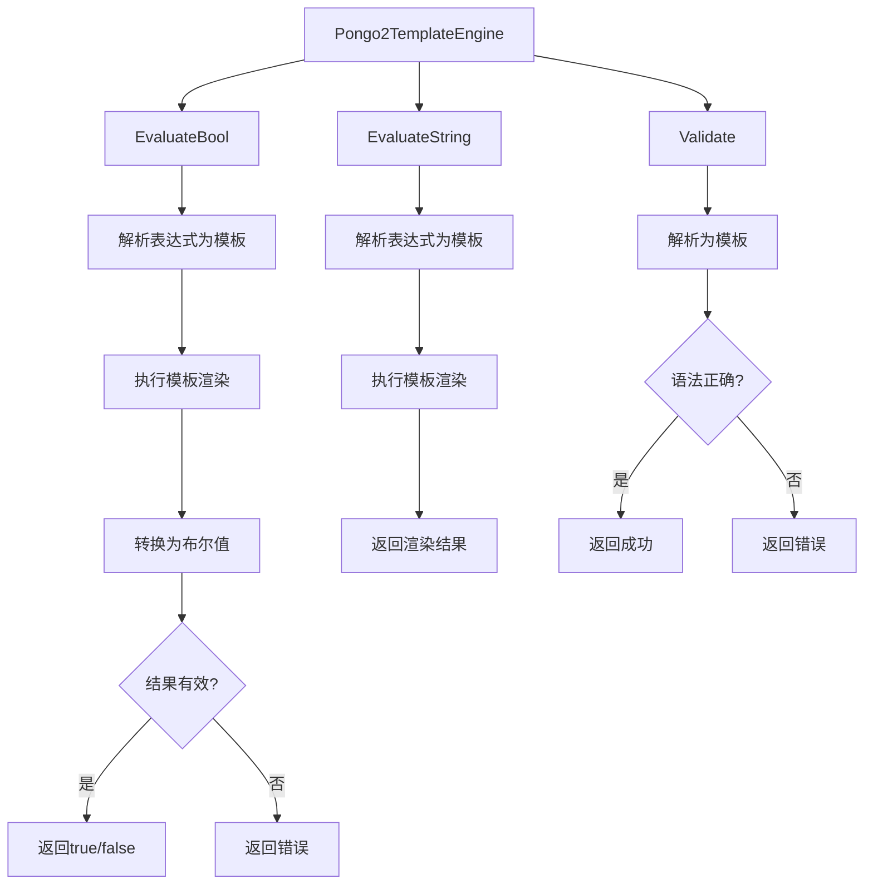
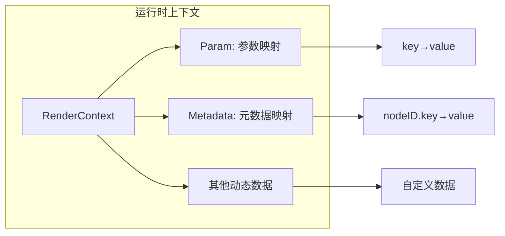

# Template 模块流程图

## 模板引擎接口

```mermaid
flowchart TD
    A[TemplateEngine Interface] --> B[EvaluateBool: 求布尔值]
    A --> C[EvaluateString: 求字符串值]
    A --> D[Validate: 验证语法]

    B --> E[expression: 表达式]
    B --> F[ctx: 渲染上下文]
    B --> G[返回bool或错误]

    C --> H[expression: 表达式]
    C --> I[ctx: 渲染上下文]
    C --> J[返回string或错误]

    D --> K[expression: 表达式]
    K --> L[返回验证结果]
```

## Pongo2模板引擎流程

```mermaid
flowchart TD
    A[Pongo2TemplateEngine] --> B[EvaluateBool]
    B --> C[解析表达式为模板]
    C --> D[执行模板渲染]
    D --> E[转换为布尔值]
    E --> F{结果有效?}
    F -->|是| G[返回true/false]
    F -->|否| H[返回错误]

    A --> I[EvaluateString]
    I --> J[解析表达式为模板]
    J --> K[执行模板渲染]
    K --> L[返回渲染结果]

    A --> M[Validate]
    M --> N[解析为模板]
    N --> O{语法正确?}
    O -->|是| P[返回成功]
    O -->|否| Q[返回错误]
```

## 渲染上下文构建

```mermaid
flowchart LR
    subgraph 运行时上下文
    A[RenderContext] --> B[Param: 参数映射]
    A --> C[Metadata: 元数据映射]
    A --> D[其他动态数据]
    end

    B --> E[key→value]
    C --> F[nodeID.key→value]
    D --> G[自定义数据]
```