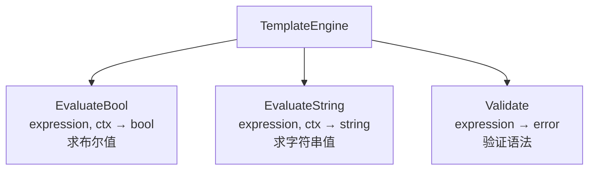
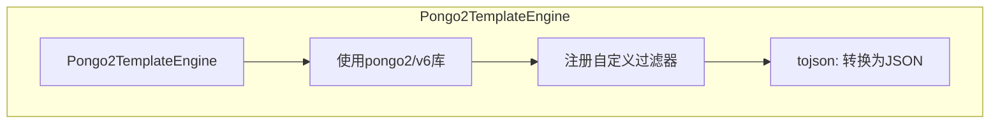
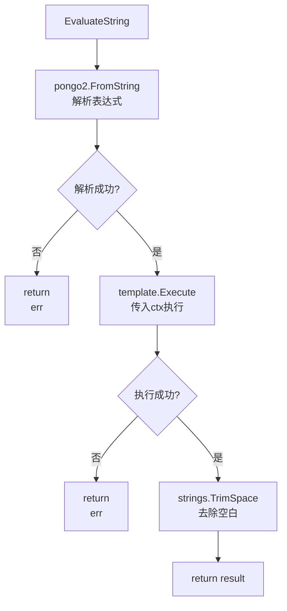
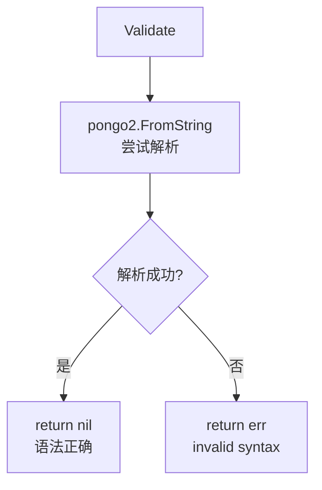
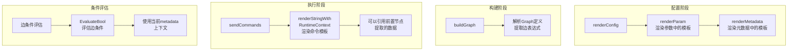

# Template 模块流程图

## TemplateEngine 接口



## Pongo2TemplateEngine 实现



## EvaluateBool 执行流程

```mermaid
flowchart TD
    A[EvaluateBool] --> B[提取内部表达式<br/>去除{{和}}]
    B --> C[处理布尔字面量<br/>替换true/false<br/>为字符串]

    C --> D[构造if-else模板<br/>"true<br/>false<br/>"]
    D --> E[pongo2.FromString<br/>解析模板]
    E --> F{解析成功?}
    F -->|否| G[return false<br/>err]
    F -->|是| H[template.Execute<br/>执行模板]

    H --> I{执行成功?}
    I -->|否| J[return false<br/>err]
    I -->|是| K[解析结果<br/>trim + tolower]
    K --> L{结果 == "true"?}
    L -->|是| M[return true]
    L -->|否| N[return false]
```

## EvaluateString 执行流程



## Validate 验证流程



## 模板上下文构建

```mermaid
flowchart TD
    A[RenderContext] --> B[Param值<br/>直接访问]
    A --> C[Param对象<br/>Param.xxx]
    A --> D[Metadata值<br/>直接访问]
    A --> E[Metadata对象<br/>Metadata.xxx]
    A --> F[nodeID.key<br/>节点提取值]

    subgraph 上下文示例
    G[ctx] --> H["name": "flowx"]
    G --> I["Param": {"name": "flowx"}]
    G --> J["Metadata": {...}]
    G --> K["Node1": {"result": "value"}]
    end
```

## 模板语法示例

```mermaid
flowchart LR
    subgraph 变量访问
    A["{{ name }}"]
    A --> B[直接访问ctx.name]
    C["{{ Param.name }}"]
    C --> D[访问ctx.Param.name]
    E["{{ Metadata.key }}"]
    E --> F[访问ctx.Metadata.key]
    end

    subgraph 条件判断
    G["{{ if eq .Param.env \"prod\" }}"]
    G --> H[生产环境分支]
    I["{{ else }}"]
    I --> J[其他环境分支]
    K["{{ end }}"]
    end

    subgraph 过滤器
    L["{{ .value | tojson }}"]
    L --> M[转换为JSON字符串]
    end

    subgraph 循环
    N["{{ range .items }}"]
    N --> O[遍历items]
    P["{{ .name }}"]
    P --> Q[访问当前元素]
    R["{{ end }}"]
    end
```

## tojson 过滤器

```mermaid
flowchart TD
    A[tojson filter] --> B{输入类型}
    B -->|string| C[直接返回]
    B -->|[]interface| D[json.Marshal]
    B -->|map[string]interface| E[json.Marshal]
    B -->|其他| F[json.Marshal<br/>interface]

    D --> G[返回JSON字符串]
    E --> G
    F --> G
```

## 模板渲染时机

